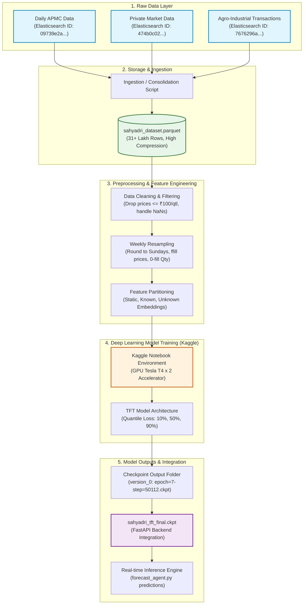

# Data Pipeline & TFT Model Training Documentation

This document provides a comprehensive step-by-step explanation of the raw data collection, preprocessing, feature engineering, and deep learning **Temporal Fusion Transformer (TFT)** model training pipeline for Project Sahyadri 2.0.

---

## 1. End-to-End Architecture Flow

Below is the diagrammatic flow representing the data lifecycle from collection to prediction.



---

## 2. Step 1: Raw Data Collection from Elasticsearch

The raw agricultural transactional records were extracted from the **MahaAgriExchange (MahaAgX)** portal database using query scripts targeting an Elasticsearch cluster. 

The three primary datasets utilized for market modeling and price forecasting include:

| Dataset Name | MahaAgX Dataset ID | Historical Range | Description & Key Fields |
| :--- | :--- | :--- | :--- |
| **Daily APMC Commodity Arrivals and Prices** | `09739e2a-d809-11f0-b972-af914ab1614f` | 2015 – Present | State-regulated mandi transactions. Fields: `apmc_name_eng`, `comm_name_eng`, `variety_name_eng`, `min_rate`, `max_rate`, `modal_rate`, `arrivals`, `r_date`. |
| **Private Market Daily Commodity Arrivals and Prices** | `474b0c02-cfb8-4a33-8d6e-2f419a0c847e` | 2013 – Present | Private mandi transaction receipts. Fields: `user_name` (Private Market), `crop_name`, `dist_name`, `min_rate`, `max_rate`, `model_rate`, `receipt_qty`. |
| **Agro-Industrial Direct Commodity Transactions** | `7676296a-2d0c-4abb-b7db-a366795e8bb6` | 2020 – Present | Direct procurement agreements between corporate buyers and growers. Fields: `cname` (Corporate Buyer), `eng_name`, `dist_name`, `Value_in_Rs`, `Qty_in_Qtl`, `Tran_date`. |

---

## 3. Step 2: Parquet File Consolidation

Once retrieved, the raw JSON transactions were consolidated into a unified tabular dataset:
* **Output Path:** `sahyadri_dataset.parquet`
* **Size:** Over **31,000,000 (31 Lakh) rows** of historical transaction logs.

### Why Parquet Format?
> [!NOTE]
> Apache Parquet is a columnar storage file format optimized for fast data processing.
> * **High Compression:** Row-oriented files like JSON or CSV are extremely bulky. Parquet uses run-length encoding, dictionary encoding, and Snappy compression to shrink the dataset down to a fraction of its original size.
> * **Fast I/O:** Reading column subsets is significantly faster because only the queried columns are loaded into memory, saving valuable RAM and overhead during Kaggle notebook execution.
> * **Data Type Preservation:** Unlike CSVs which require re-parsing strings, Parquet maintains strict schema definitions for data types (dates, integers, floats, categoricals).

---

## 4. Step 3: Feature Engineering & Preprocessing

The raw transaction data cannot be fed directly into a Deep Learning model. The preprocessing script, [sahyadri_colab_training.py](file:///c:/Users/Shashank/OneDrive/Desktop/data_sets_fetched/market_and_transaction_data/sahyadri_colab_training.py), performs several critical sequence adjustments and feature derivations:

### A. Data Cleaning
1. **Datetime Standardization:** Parse raw date strings into Pandas `datetime64[ns]` formats.
2. **Numeric Coercion:** Coerce rates and quantity values to floats; discard non-numeric outliers.
3. **Price Filtering:** Exclude invalid or corrupt transactions where the `modal_price` was less than or equal to ₹100 per quintal (distinguishing valid crop sales from bulk waste or noise).

### B. Weekly Resampling & Gap Filling
Deep Learning models like TFT require continuous time steps without temporal gaps.
1. **Sunday Date Rounding:** Days are rounded to the Sunday of their respective weeks using:
   $$\text{week\_date} = \text{date} + ((6 - \text{weekday}) \bmod 7)\text{ days}$$
2. **Intermediate Aggregation:** To avoid running out of RAM, daily transactions within the same week, district, mandi, and commodity are collapsed into weekly averages:
   * `modal_price` $\rightarrow$ Mean weekly rate.
   * `min_price` $\rightarrow$ Minimum observed weekly rate.
   * `max_price` $\rightarrow$ Maximum observed weekly rate.
   * `quantity` $\rightarrow$ Cumulative volume traded in that week.
3. **Missing Week Infill:** If a commodity has no transactions in a week, a forward-fill (`ffill`) is applied to carry forward the last known price.
4. **Quantity Zero-Fill:** Missing week volumes are set to `0.0` (indicating no trade occurred).
5. **Length Filtering:** Eliminate short histories. A group (combination of commodity, district, source, and market) must have at least **15 consecutive weeks** of transaction history to be used.
6. **Continuous Time Index:** Creates a unified integer index `time_idx` (representing sequential elapsed weeks since the base dataset date) to align all different time-series groups together.

### C. Input Covariate Categories
The TFT model organizes inputs into four specific categories to understand temporal relationships:

```
+-----------------------------------------------------------------------------------+
| Static Categoricals (Entity Context):                                             |
| Embeddings for: commodity, district, market_name, source_type                     |
+-----------------------------------------------------------------------------------+
| Time-Varying Known Categoricals (Calendar Context):                               |
| month (1-12, captures yearly crop seasonality)                                    |
+-----------------------------------------------------------------------------------+
| Time-Varying Known Reals (Timeline Context):                                      |
| time_idx (Index increment representing chronological steps)                       |
+-----------------------------------------------------------------------------------+
| Time-Varying Unknown Reals (Historical Target & Context):                        |
| modal_price (Target), quantity (Trade volume), volatility_4w (Historical variance)|
+-----------------------------------------------------------------------------------+
```
* **Volatility Feature:** `volatility_4w` represents a rolling 4-week standard deviation of prices, enabling the model to adjust predictions depending on how stable or erratic a market is at any given time.

---

## 5. Step 4: Temporal Fusion Transformer (TFT) Model Architecture

### What is a Temporal Fusion Transformer?
The **Temporal Fusion Transformer (TFT)** is a state-of-the-art deep learning model developed by Google research, specifically optimized for multi-horizon forecasting. Traditional models like LSTMs or standard Transformers either struggle with long-term predictions or ignore static metadata (like geographic region or commodity details). 

TFT solves this by incorporating specialized components:

```
                       +---------------------------------------+
                       |       Static Entity Embeddings        |
                       | (Static metadata defines the context) |
                       +-------------------+-------------------+
                                           |
                                           v
+------------------------+     +-------------------+     +-------------------------+
| Historical Inputs      | --> | Variable Select   | --> | Temporal LSTM Layer     |
| (Past Prices & Volume) |     | Networks (VSN)    |     | (Captures local trends) |
+------------------------+     +-------------------+     +------------+------------+
                                                                      |
+------------------------+     +-------------------+                  |
| Future-Known Inputs    | --> | Variable Select   |                  |
| (Future Month, Index)  |     | Networks (VSN)    |                  |
+------------------------+     +-------------------+                  |
                                           |                          |
                                           v                          v
                       +---------------------------------------+
                       |    Multi-Head Self-Attention Block    | <----+
                       | (Learns annual cycles & seasonality)  |
                       +-------------------+-------------------+
                                           |
                                           v
                       +-------------------+-------------------+
                       |          Quantile Output Layer        |
                       |    (Generates 10%, 50%, 90% Bounds)   |
                       +---------------------------------------+
```

### Key Subcomponents Explained
1. **Variable Selection Networks (VSN):** Time-series data contains many features, but not all are useful at every step. VSNs dynamically filter out noisy or irrelevant inputs. For instance, it can assign a high weight to historical prices during price fluctuations, but switch focus to seasonality (month) during harvest seasons.
2. **Gated Residual Networks (GRN):** GRN layers provide the model with "skip connections." If a complex non-linear transformation isn't needed, the GRN allows the neural network to bypass that block entirely. This prevents overfitting on small datasets and reduces computational cost.
3. **Static Covariate Encoders:** Instead of training separate models for cotton in Wardhana and wheat in Nagpur, a single TFT model encodes static features (`commodity`, `district`, `market_name`) as dense embeddings. This allows the model to share learned behaviors across different markets (e.g., if cotton prices rise in one district, the model applies that pattern to surrounding areas).
4. **Temporal Self-Attention Layer:** Uses multi-head self-attention to capture long-range interactions. This is what allows the model to associate a price trend in November with harvest events that occurred months earlier.

---

## 6. Step 5: GPU Model Training in Kaggle

Because processing 31 Lakh rows with deep neural networks is computationally intensive, training was executed on a high-performance cluster.

### Training Environment
* **Platform:** Kaggle Notebook
* **Accelerator:** Dual **Nvidia Tesla T4 GPUs (GPU T4 x2)**
* **Framework:** PyTorch Forecasting built on top of PyTorch Lightning.

### Hyperparameters Configured
* **Encoder Length (Lookback Window):** `12` weeks (~3 months of historical data).
* **Decoder Length (Forecast Horizon):** `4` weeks (~1 month of future forecast).
* **Batch Size:** `256` sequences.
* **Learning Rate:** `0.03` using the Ranger optimizer (an advanced combination of RAdam and Lookahead optimizer).
* **Regularization:** Dropout set to `0.15` and Gradient Clipping set to `0.1` to prevent gradient explosion.
* **Loss Function:** `QuantileLoss([0.1, 0.5, 0.9])` to output probabilistic bounds instead of single-point forecasts.

---

## 7. Step 6: Model Outputs & Saved Checkpoints

Once training completed, the output metrics and files were saved inside the workspace directories.

### Checkpoint Output Folder Structure
The training outputs are stored under the workspace folder [sahyadri_trained_model[TFT_MODEL]/](file:///c:/Users/Shashank/OneDrive/Desktop/data_sets_fetched/market_and_transaction_data/sahyadri_trained_model[TFT_MODEL]):

```
sahyadri_trained_model[TFT_MODEL]/
├── sahyadri_tft_final.ckpt              <-- The production-ready model checkpoint
└── sahyadri_tft/
    └── version_0/
        ├── checkpoints/
        │   └── epoch=7-step=50112.ckpt   <-- Best epoch checkpoint from training run
        ├── hparams.yaml                  <-- Extracted model hyperparameters
        └── events.out.tfevents...        <-- TensorBoard execution log for validation metrics
```

### Explaining the Training Results
1. **Epochs and Step Count:** 
   * The best model was saved at **`epoch=7-step=50112.ckpt`**.
   * In PyTorch Lightning, epochs are 0-indexed. This means the model completed **8 full training epochs** (Epoch 0 through Epoch 7).
   * It ran for a total of **50,112 optimizer steps**, indicating it processed 50,112 batches of size 256.
2. **Early Stopping:** Training terminated around this point due to early stopping callbacks. The validation loss (`val_loss`) ceased to decrease significantly, indicating the model had reached optimal convergence without overfitting.
3. **Quantile Outputs Generated:**
   * **10th Percentile ($q=0.10$):** Interpreted as the **minimum price boundary** (worst-case market rate).
   * **50th Percentile ($q=0.50$):** Interpreted as the **modal price** (most likely market rate).
   * **90th Percentile ($q=0.90$):** Interpreted as the **maximum price boundary** (best-case market rate).
4. **Backend Integration:**
   * The final weights file **`sahyadri_tft_final.ckpt`** is loaded by the FastAPI backend's [forecast_agent.py](file:///c:/Users/Shashank/OneDrive/Desktop/data_sets_fetched/market_and_transaction_data/backend/app/agents/forecast_agent.py) during application startup.
   * When a user queries a crop prediction, the backend runs real-time inference on the checkpoint and returns the multi-week quantile predictions to render the 3D pricing charts.
