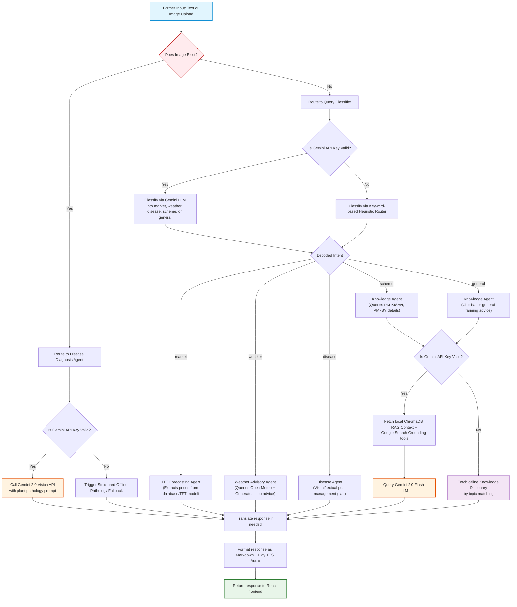

# Gemini 2.0 Chatbot Integration & Multi-Agent Routing Architecture

This document outlines the design, scalability, and code structure of the **Gemini 2.0 Flash** integration within the agricultural chatbot (Sahyadri Mitra AI) in Project Sahyadri 2.0.

---

## 1. End-to-End Chatbot Query Lifecycle

When a farmer submits a question or uploads a crop image, the query is routed through a multi-agent pipeline. Below is the step-by-step execution flow:



---

## 2. Model Mapping by Feature / Task

To balance latency, operational costs, and capability, the system maps all AI features to the unified **Gemini 2.0 Flash** model, leveraging its multimodal and tool integration features:

| Task / Feature | Selected Model | Execution Modality | Why This Model? |
| :--- | :--- | :--- | :--- |
| **Intent Classification** | `gemini-2.0-flash` | Text-only classification | Low-latency inference ensures that user messages are categorized within milliseconds before routing to backend executors. |
| **General & RAG Queries** | `gemini-2.0-flash` | Context-Augmented Text | Integrates semantic local context and Google Search Grounding to verify details in the response. |
| **Multimodal Crop Pathology** | `gemini-2.0-flash` | Multimodal (Text + Vision) | Native vision processing enables the model to identify details in plant leaves or stems without external OCR or pre-classifiers. |
| **Weather Impact Advisory** | `gemini-2.0-flash` | Tabular Data to Text | Summarizes Open-Meteo numerical weather forecasts into agricultural alerts. |
| **Dynamic Translation** | `gemini-2.0-flash` | JSON Batch Translation | High-throughput token processing enables translating long lists of APMC markets and varieties in a single call. |

---

## 3. SDK Integration & API Call Methods

We call the Gemini API using the official `google-generativeai` python package. The functions utilize three primary calling paradigms depending on the task:

### A. Simple Text-Based Prompt Generation
Used for Intent Routing, Weather Advisories, and general translations.
* **Method**: `GenerativeModel.generate_content(prompt)`
* **Code Example**:
  ```python
  import google.generativeai as genai
  genai.configure(api_key=GEMINI_API_KEY)
  model = genai.GenerativeModel("gemini-2.0-flash")
  response = model.generate_content(prompt)
  result_text = response.text
  ```

### B. Search Grounding Integration (Real-Time Knowledge)
Enables Gemini to pull current facts directly from Google Search.
* **Method**: Initializing the model with search tools.
* **Code Example**:
  ```python
  tools = [{"google_search_retrieval": {}}]
  model = genai.GenerativeModel("gemini-2.0-flash", tools=tools)
  # The model automatically executes web search searches when the prompt contains queries like "Tomato price next week in Pune?"
  response = model.generate_content(prompt)
  ```

### C. Multimodal Vision (Leaf Pathology Analysis)
Sends binary crop photographs along with instructions to diagnose plant health.
* **Method**: `GenerativeModel.generate_content([prompt, image_part])`
* **Input Structure**: The image is packaged as a dictionary specifying the `mime_type` and raw base64/bytes `data`.
* **Code Example**:
  ```python
  image_part = {
      "mime_type": mime_type, # e.g. "image/jpeg"
      "data": image_bytes     # raw binary file content
  }
  prompt = "Analyze this image for disease and provide an organic treatment plan."
  response = model.generate_content([prompt, image_part])
  diagnosis_text = response.text
  ```

---

## 4. Scalability & Quota Protection Mechanics

To ensure the application remains highly responsive and functional even when public API limits are reached (e.g., Gemini `429 Quota Exceeded` errors), the system implements three scaling and safety layers:

### A. Lazy Loading Initialization
The Gemini generative model is not initialized at server startup. Instead, the function `_get_gemini()` lazy-loads the module and initializes the model context only on demand, preventing startup delays and saving background resources.

### B. Strict Offline Fallbacks
Every agent has a try-except shield around LLM calls. If the Gemini API key is missing, invalid, or exhausted, the system immediately downgrades to a **local fallback engine** using:
* **Intent Routing**: Bypasses the LLM classifier and uses a regex/keyword classifier.
* **Offline Knowledge Base**: Maps query terms (e.g., *NPK*, *subsidy*, *thrips*) to pre-written, multilingual agricultural guide tables stored in memory.
* **Heuristic Weather advisories**: Uses hardcoded threshold criteria (e.g. humidity > 80% with low temp = high fungus risk) to build advisories instead of calling the LLM.

### C. Response Caching
API queries and coordinates (like weather and market recommendation values) are wrapped in cache decorators (`@cache_response` using local memory or Redis) with a Time-To-Live (TTL) of **12 hours (43,200 seconds)**. This dramatically reduces redundant calls to the Gemini API for identical regional searches.

---

## 5. Key Integration Functions & Code Files

The multi-agent system divides its responsibilities across specialized Python modules:

### A. Core Initialization
* **File**: [`config.py`](file:///c:/Users/Shashank/OneDrive/Desktop/data_sets_fetched/market_and_transaction_data/backend/app/config.py)
  * `is_gemini_configured() -> bool`: Returns `True` only if a valid, non-placeholder API key of size > 10 characters is found in the environment.
* **File**: [`knowledge_agent.py`](file:///c:/Users/Shashank/OneDrive/Desktop/data_sets_fetched/market_and_transaction_data/backend/app/agents/knowledge_agent.py)
  * `_get_gemini(enable_search: bool = True)`: Configures the Google Generative AI SDK. When `enable_search=True`, it attaches Google Search Grounding (`google_search_retrieval` tool) to supply the model with real-time web results.

### B. Intent Routing Agent
* **File**: [`router.py`](file:///c:/Users/Shashank/OneDrive/Desktop/data_sets_fetched/market_and_transaction_data/backend/app/agents/router.py)
  * `classify_intent(text: str) -> str`: Sends a structured prompt to Gemini asking it to classify the query as `"market"`, `"weather"`, `"disease"`, `"scheme"`, or `"general"`. Falls back to keyword-based regex classification if the API is offline.
  * `route_and_execute(...)`: The central coordinator. It parses coordinates, extracts crop entities, retrieves SQL conversation history, queries the matching agent, and returns the unified response.

### C. RAG & Web Search Agent
* **File**: [`knowledge_agent.py`](file:///c:/Users/Shashank/OneDrive/Desktop/data_sets_fetched/market_and_transaction_data/backend/app/agents/knowledge_agent.py)
  * `answer_knowledge_query(...)`: Fetches relevant local vector context from ChromaDB (`query_rag_context`), appends conversation history context, and templates a prompt to Gemini Flash. If the LLM fails, it routes the query to `OFFLINE_KNOWLEDGE` maps (available in English, Hindi, and Marathi).

### D. Multimodal Leaf Pathology Agent
* **File**: [`disease_agent.py`](file:///c:/Users/Shashank/OneDrive/Desktop/data_sets_fetched/market_and_transaction_data/backend/app/agents/disease_agent.py)
  * `diagnose_crop_image(image_bytes, mime_type, lang)`: Accepts uploaded binary leaf photos, packages them for the Gemini Vision API, and applies `SYSTEM_DISEASE_PROMPT` to generate a structured management plan (symptoms, root cause, biological control, and safe chemical dosages). Falls back to an offline diagnostics guide if the API key is unavailable.

### E. Weather Impact Agent
* **File**: [`weather_agent.py`](file:///c:/Users/Shashank/OneDrive/Desktop/data_sets_fetched/market_and_transaction_data/backend/app/agents/weather_agent.py)
  * `get_weather_advisory(district, commodity, lang)`: Queries numerical meteorological weather forecasts (rain, temp, wind) from the Open-Meteo API. If Gemini is online, it prompts the model to analyze these forecasts and synthesize a farmer-friendly crop warning. If offline, it outputs hardcoded, rules-based seasonal weather suggestions.
