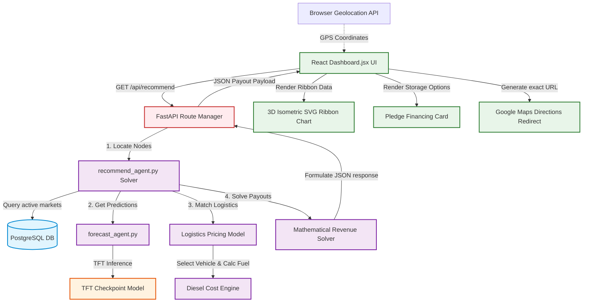

# Detailed Architectural Report: Interactive Market Arbitrage Dashboard

This document details the logic, purpose, technical implementation, and full end-to-end architecture of the **Interactive Market Dashboard** in Project Sahyadri 2.0.

---

## 1. The Core Logic & Business Problem
Farmers in Maharashtra face severe **post-harvest decision dilemmas**:
* **Information Asymmetry:** Spot prices across APMC mandis, private mandis, and corporate buyers fluctuate independently and are hard to track.
* **Distress Selling:** Due to immediate cash needs (debts, household expenses), farmers often dump their crops immediately after harvest when supply is high and prices are at their seasonal lowest.
* **Logistics Complexity:** Farmers do not know if traveling to a farther mandi with a higher spot price is financially viable once fuel and truck renting costs are factored in.

### Why this Dashboard exists:
The Market Dashboard solves these problems by providing:
1. **Multi-Horizon Price Forecasting:** Tells the farmer what their crop will be worth 7, 14, and 30 days into the future.
2. **Logistics Optimization:** Recommends the exact vehicle type, estimates diesel costs, and shows the net payout for different destinations.
3. **Pledge Financing Integration:** Shows how a short-term DCCB bank loan can cover cash needs, enabling them to store crops in an MSWC warehouse and sell at a peak price later.

---

## 2. Technical Achievement (How We Built It)

```
   [ MahaAgX Elastic Registries ]
                 │
                 ▼ (Parquet Compression)
      [ sahyadri_dataset.parquet ]
                 │
                 ▼ (Dual T4 GPU Training)
    [ Temporal Fusion Transformer Model ]
                 │
                 ▼ (FastAPI recommend_agent.py)
   [ Spatial & Arbitrage Mathematical Solver ]
                 │
                 ▼ (React SPA Client)
 [ 3D Isometric Ribbon SVG Chart & Slider controls ]
```

### A. Price Forecasting Engine
* **Raw Ingestion:** We consolidate 3.1 Million daily transaction records from Elasticsearch endpoints on the MahaAgX portal. These are compressed into a column-oriented `sahyadri_dataset.parquet` file for high-speed training inputs.
* **Model Training:** We train a **Temporal Fusion Transformer (TFT)** model using PyTorch Forecasting on Kaggle with dual **Nvidia Tesla T4 GPUs (T4 x2)**. 
* **Loss Function:** We use a quantile loss function:
  $$\mathcal{L}_{quantile} = \text{QuantileLoss}([0.1, 0.5, 0.9])$$
  This yields three price curves: 10th percentile (worst-case), 50th percentile (average/modal), and 90th percentile (best-case/upside).
* **Inference serving:** The FastAPI backend loads the model weights (`sahyadri_tft_final.ckpt`) in a singleton pattern. It restricts PyTorch CPU threads to 1 (`torch.set_num_threads(1)`) to avoid server lag during simultaneous requests.

### B. Mathematical Arbitrage Solver
When `/api/recommend` is called, the backend executes the recommendation solver:
1. **Geodesic Distance Approximation:** Calculates the Haversine distance from the farmer's GPS coordinates (or district center fallback) to all active market nodes. A winding multiplier ($1.25$) is applied to simulate road path winding:
   $$D = 1.25 \times D_{geo}$$
2. **Logistics Matching:** Matches crop weight (in quintals) to standard vehicles:
   * $0 < Q \le 10$ QTL $\to$ Mini Pickup (12 km/L)
   * $10 < Q \le 30$ QTL $\to$ Pickup Truck (8 km/L)
   * $30 < Q \le 80$ QTL $\to$ Medium Truck (5 km/L)
   * $80 < Q \le 200$ QTL $\to$ Heavy Truck (4 km/L)
   * $Q > 200$ QTL $\to$ Multi-Truck Heavy, where $N_{trucks} = \lceil Q / 200 \rceil$.
3. **Diesel Expense Calculation:** Based on a fixed diesel price of **₹95.00/L**:
   $$C_{fuel} = \left( \frac{D}{\text{Mileage}} \right) \times 95.00 \times N_{trucks}$$
4. **Net Revenue Payout Equations:**
   * **Immediate Sale:** 
     $$R_{immediate} = (P_{spot} \times Q) - C_{fuel}$$
   * **Holding Sale ($d$ days):** 
     $$R_{hold}(d) = (P_{pred}(d) \times Q) - C_{fuel} - \text{Rent}(d) - \text{Interest}(d)$$
     * $\text{Rent}(d) = Q \times R_{rent} \times (d / 30)$
     * $\text{Interest}(d) = (P_{spot} \times Q \times LTV) \times I_{rate} \times (d / 365)$

---

## 3. Clean Dashboard Architecture (System Diagram)

Below is the clean architecture showing the flow of request parameters, spatial data matching, and rendering parameters:



---

## 4. Frontend Rendering Techniques

### A. Stacking Context (z-Index) Resolution
* **The Problem:** Expanded custom dropdown menus (using the `SearchableSelect` React wrapper) were clipping beneath neighboring cards due to browser stacking context rules.
* **The Solution:** The React container toggles the component wrapper's z-index dynamically:
  ```javascript
  // Trigger z-index elevation when open to overlay card borders cleanly
  const zClass = isOpen ? "z-50 relative" : "z-20 relative";
  ```

### B. 3D Isometric SVG Ribbon Chart Math
To project flat price lists into a three-dimensional perspective ribbon, we map each price point $(x, y, z)$ to $(px, py)$ coordinate dimensions:
* $x$ represents the **Timeline Index** (Week 0 to Week 4).
* $y$ represents the **Forecasting Price** (scaled to canvas height).
* $z$ represents the **Market Depth Offset** (Market Rank 0, 1, or 2).

#### Mathematical Projection Formulas:
$$px = 75 + x \cos(12^\circ) + z \cos(-22^\circ)$$
$$py = 155 - y + x \sin(12^\circ) + z \sin(-22^\circ)$$

#### Depth-Ordering Algorithm (Painter's Algorithm):
To prevent drawing overlaps (where a background line clips in front of a foreground ribbon), the SVG elements are sorted by depth ($z$) and rendered back-to-front:
1. **Rank 2 (Back Ribbon):** Rendered first.
2. **Rank 1 (Middle Ribbon):** Rendered second.
3. **Rank 0 (Front Ribbon):** Rendered third.
Cubic Bezier curve points (`C` path instructions) smooth out the price shifts across weeks.
