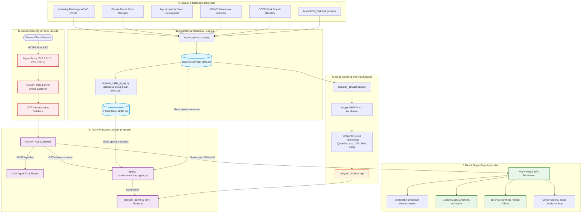

# Master Presentation & Unified Technical Report

This presentation-ready report details the problem statements, goals, backend engineering, frontend dashboards, API structures, and unified architecture of **Project Sahyadri 2.0**.

---

# PART 1: Slide-by-Slide Presentation Structure

## Slide 1: Title Slide & Project Overview
* **Slide Title:** Project Sahyadri 2.0: AI-Powered Multi-Horizon Price Forecasting & Spatial Arbitrage Recommendation System
* **👶 Beginner Analogy:** 
  > *"Imagine you are a farmer with a truck full of harvested crops. You want to sell them for the highest price, but you don't know if you should sell today at the market down the street, or wait a few weeks and drive to a bigger market in the next town. Sahyadri 2.0 is a smart digital advisor that tells you exactly when, where, and how to sell to make the most money."*
* **⚙️ Technical Focus:** A unified agricultural decision engine fusing deep learning (Temporal Fusion Transformer), spatial database networks, and voice-enabled conversational interfaces.

---

## Slide 2: Problem Statement & Project Goals
* **Slide Title:** Solving the Post-Harvest Decision Dilemma
* **👶 Beginner Analogy:**
  > *"Farmers face a two-sided puzzle every season: When should I sell, and where should I sell? Right now, they try to solve this by looking at outdated paper notices, listening to the radio, or asking neighbors. Because they lack immediate cash, they often engage in 'distress selling'—selling their hard work immediately for a low price."*
* **⚙️ Technical Focus:**
  * **Information Asymmetry:** Fuses fragmented domains (spot prices, meteorological forecasts, warehouse storage availability, logistics truck pricing, bank credit lines).
  * **Distress Selling Mitigation:** Calculates low-interest **Warehouse Receipt Loans** from DCCB cooperative banks to provide cash advances, enabling farmers to hold crops during seasonal price drops.
  * **Financial Impact:** Resolves state-scale losses of **₹500 to ₹1,500 per quintal** on sub-optimal crop sales.

---

## Slide 3: Ingestion Pipeline & Raw Datasets
* **Slide Title:** Data Collection & High-Performance Parquet Conversion
* **👶 Beginner Analogy:**
  > *"Before cooking a big dinner, you need to collect ingredients from different grocery stores and chop them up so they are ready to cook. We fetch millions of raw transaction logs from Elasticsearch databases and pack them tightly into a single compressed 'Parquet' file so our computer can read them in seconds."*
* **⚙️ Technical Focus:**
  * **Elasticsearch Retrieval:** Fetches transactional logs from the **MahaAgriExchange (MahaAgX)** portal.
  * **The 3 Market Datasets:**
    * *Daily APMC Market Prices* (`ID: 09739e2a-d809-11f0-b972-af914ab1614f`)
    * *Private Market Daily Prices* (`ID: 474b0c02-cfb8-4a33-8d6e-2f419a0c847e`)
    * *Agro-Industrial Direct Transactions* (`ID: 7676296a-2d0c-4abb-b7db-a366795e8bb6`)
  * **Data Consolidation:** Saves over **3.1 Million (31 Lakh) rows** into a column-oriented `sahyadri_dataset.parquet` file for high-speed I/O during model training.

---

## Slide 4: Feature Engineering & Preprocessing
* **Slide Title:** Sequence Alignment & Temporal Feature Layout
* **👶 Beginner Analogy:**
  > *"Our smart price-predicting computer needs to look at data points that are perfectly lined up week-by-week. If a market was closed on a holiday, we fill that gap with the last known price. We also divide information into things that never change (like the crop type) and things that change constantly (like price and trading volume)."*
* **⚙️ Technical Focus:**
  * **Sunday Date Rounding:** Standardizes daily timestamps to Sunday weekly dates:
    $$\text{week\_date} = \text{date} + ((6 - \text{weekday}) \bmod 7)\text{ days}$$
  * **Sequence Cleansing:** Drops outliers where price $\le$ ₹100/qtl. Gaps are forward-filled (`ffill`) for prices and zero-filled (`0.0`) for quantities.
  * **Feature Partitioning:**
    * *Static Categoricals (Embeddings):* `commodity`, `district`, `source_type`, `market_name`.
    * *Time-Varying Known Categoricals:* `month` (captures yearly supply seasonality).
    * *Time-Varying Known Reals:* `time_idx` (chronological timeline index).
    * *Time-Varying Unknown Reals:* `modal_price` (target), `quantity` (volume), `volatility_4w` (rolling 4-week standard deviation of price).

---

## Slide 5: Deep Learning Price Forecasting (TFT Model)
* **Slide Title:** Multi-Horizon Forecasting via Temporal Fusion Transformers
* **👶 Beginner Analogy:**
  > *"Instead of just guessing a single future price, our AI model acts like a weather reporter who tells you: 'There is a 90% chance of a high price, a 50% chance of an average price, and a 10% chance of a low price.' This helps the farmer manage risk safely."*
* **⚙️ Technical Focus:**
  * **Training Environment:** Trained on Kaggle Notebooks utilizing dual **Nvidia Tesla T4 GPUs (T4 x2)**.
  * **TFT Subcomponents:**
    * *Variable Selection Networks (VSN):* Dynamically filters out irrelevant features.
    * *Gated Residual Networks (GRN):* Bypasses unnecessary neural layers to prevent overfitting.
    * *Static Covariate Encoders:* Encodes geographic and commodity entity embeddings.
  * **Loss Function:** `QuantileLoss([0.1, 0.5, 0.9])` generating 10th (worst-case), 50th (modal), and 90th (best-case) percentile price boundaries.
  * **Checkpoint:** Compiled and exported as `sahyadri_tft_final.ckpt` after completing **8 full training epochs** (Epoch 0 to 7) and **50,112 optimizer steps**.

---

## Slide 6: Database Setup & Spatial Seeding
* **Slide Title:** Spatial Infrastructure Registries & GeoJSON Processing
* **👶 Beginner Analogy:**
  > *"To guide the farmer, our database needs to know where all the local warehouses, cooperative bank branches, and soil labs are located. We take geographic map files (GeoJSON) and load their coordinates and details into our SQL database."*
* **⚙️ Technical Focus:**
  * **SQLite operational registries:**
    * *MSWC Warehouses:* 200 facilities with capacities, coordinates, and dynamic rent models.
    * *DCCB Bank Branches:* 7,608 cooperative credit hubs with deterministic interest rates (7.0% - 7.9% p.a.) calculated using bank-name MD5 hashes.
    * *KVK Advisory Stations:* 101 agronomic extension centers.
    * *Soil Testing Labs:* Expanded from 399 to **873 verified Maharashtra soil labs** using raw coordinate arrays parsed from the new `MahaAGX_SoilLabs.geojson` dataset.
  * **Coordinate Fallback Engine:** Resolves missing coordinates by scanning addresses against `location_coords.json` or mapping them to district centroids.

---

## Slide 7: Database Migration (SQLite to PostgreSQL)
* **Slide Title:** High-Performance Database Migration
* **👶 Beginner Analogy:**
  > *"When our website gets busy with thousands of farmers searching for prices at the same time, a local file-based database can slow down. We build a high-speed pipe that streams over 3 million rows to a server-grade database in under 5 minutes without crashing."*
* **⚙️ Technical Focus:**
  * **Target Database:** PostgreSQL port 5432.
  * **Bulk Streaming Engine:** Reads SQLite rows in chunks of **25,000 rows** (`CHUNK_SIZE`) and uses `psycopg2.extras.execute_values()` to achieve write throughput of **10,000+ rows/second**.
  * **Postgres Indices:** Creates indexes `idx_transactions_comm_dist`, `idx_transactions_source_market`, and `idx_transactions_date`.
  * **Spatial Synchronization:** The script automatically runs `migrate_spatial_tables`, truncating Postgres tables using `CASCADE` and copying warehouses, banks, soil labs, and KVK registries to guarantee absolute data consistency.

---

## Slide 8: Backend Server & Security Shield
* **Slide Title:** FastAPI Application Server & Request Tracing Middleware
* **👶 Beginner Analogy:**
  > *"Our server is like a secure bank lobby. It has a guard at the door (Nginx) to encrypt data, a visitor limit counter (SlowAPI) to prevent overcrowding, and a guest logger that gives every visitor a unique badge number (Request ID) to trace their actions."*
* **⚙️ Technical Focus:**
  * **ASGI Stack:** FastAPI served by Uvicorn. Enables secure **HTTPS (SSL/TLS)** via `sahyadri.crt` and `sahyadri.key`.
  * **Rate Limiting:** Capped globally per client IP via SlowAPI (Redis backend storage, in-memory fallback).
  * **Access Authorization:** Secured endpoints require JWT verification.
  * **HTTP Middleware:** 
    * Injects unique UUID string tracker (`X-Request-ID`).
    * Computes processing duration (`X-Process-Time` header).
    * Masking: Replaces server signatures with `Server: Sahyadri Secure Shield` and intercepts uncaught system crashes to return masked generic error payloads.

---

## Slide 9: Frontend Architecture & SVG Rendering
* **Slide Title:** React SPA & Trigonometric 3D Ribbon Charts
* **👶 Beginner Analogy:**
  > *"Instead of showing farmers boring columns of numbers, we draw a colorful, twisting 3D highway on their screen. The height of the highway shows the future price, and the depth shows different markets. We also add slide controls that instantly recalculate storage loans."*
* **⚙️ Technical Focus:**
  * **UI Framework:** Vite + React JS, styled with Vanilla CSS.
  * **Z-Index Stacking Correction:** Trigger container wrappers toggle z-index (`z-50` when expanded, `z-20` when closed) to overlay elements cleanly.
  * **3D Isometric Ribbon Price Chart:**
    * Trigonometric projection formulas:
      $$px = 75 + x \cos(12^\circ) + z \cos(-22^\circ), \quad py = 155 - y + x \sin(12^\circ) + z \sin(-22^\circ)$$
    * Painter's Algorithm: Sorts ribbons by rank and draws back-most first (Rank 2) progressing forward to Rank 0 to prevent layer overlaps.
    * Cubic Bezier Curves: Uses SVG `C` commands to smooth pricing changes.
  * **GPS Geolocation Mode:** Requests browser coordinates to calculate exact transport routes.

---

## Slide 10: Connection Layer & API Catalog
* **Slide Title:** The API Interface - Bridge Between Client and Server
* **👶 Beginner Analogy:**
  > *"The frontend dashboard and the backend server talk to each other using a special telephone system called APIs. We have exactly 8 API lines in our system. Each line has a specific job, like asking for weather, fetching price forecasts, or asking the AI chatbot a question."*
* **⚙️ Technical Focus:**
  * Exposes **exactly 8 core API endpoints** to connect the React UI with the FastAPI backend.
  * Detailed request payloads, database queries, and response properties are outlined below.

---

# PART 2: The API Connection Catalog (The 8 Core Endpoints)

```
   [ REACT FRONTEND CLIENT ]
               |
    (HTTP/HTTPS Requests)
               |
               v
  +--------------------------+
  |  NGINX / SECURITY LAYER  |
  +------------+-------------+
               |
      (Exposes 8 APIs)
               |
               v
  +--------------------------+
  |  FASTAPI BACKEND SERVER  |
  +--------------------------+
```

### 1. Diagnostic Probe (`GET /api/health`)
* **Purpose:** Monitored system health indicator.
* **Backend Processing:** Checks PostgreSQL/SQLite connection pools, pings the Redis instance, and verifies if the PyTorch TFT model weights are loaded in memory.
* **Output Payload:**
  ```json
  {
    "status": "healthy",
    "database": "up",
    "redis": "up",
    "tft_model": "loaded",
    "timestamp": 1780458992.12
  }
  ```

### 2. Localization Suggest (`GET /api/suggest`)
* **Query Parameters:** `lang` (Preferred language, e.g. `mr`, `hi`, `en`).
* **Backend Processing:** Queries distinct commodities and districts. If `lang` is non-English, it batch-translates terms using cache or Gemini before compiling label pairs.
* **Output Payload:**
  ```json
  {
    "commodities": [{"value": "SOYABEAN", "label": "सोयाबीन"}],
    "districts": [{"value": "LATUR", "label": "लातूर"}],
    "gemini_active": true
  }
  ```

### 3. Price Forecasting (`GET /api/forecast`)
* **Query Parameters:** `commodity` (Crop), `district` (Region), `base_date` (Optional YYYY-MM-DD).
* **Backend Processing:** Queries latest record date, triggers TFT forecasting singleton, and yields price quantiles (10%, 50%, 90%) for days 0, 7, 14, and 30.
* **Output Payload:**
  ```json
  {
    "commodity": "SOYABEAN",
    "district": "LATUR",
    "base_date": "2026-05-24",
    "forecasts": [
      {
        "market_name": "Latur APMC",
        "source_type": "APMC",
        "forecasts": {"0": 4200, "7": 4280, "14": 4360, "30": 4520}
      }
    ]
  }
  ```

### 4. Infrastructure Mapping (`GET /api/spatial`)
* **Query Parameters:** `district` (Region), `lang`, `latitude` (Optional user Lat), `longitude` (Optional user Lng).
* **Backend Processing:** Queries SQL tables for MSWC warehouses, DCCBs, soil labs, and KVKs matching the district aliases. Calculates Haversine distances to each and builds verified Google Maps Directions URLs.
* **Output Payload:**
  ```json
  {
    "warehouses": [
      {
        "plant_name": "Udgir Warehouse",
        "total_capacity": 5000,
        "rent_per_qtl_month": 12.0,
        "distance_km": 42.1,
        "maps_url": "https://www.google.com/maps/dir/?api=1..."
      }
    ],
    "dccb_branches": [...],
    "soil_labs": [...],
    "kvk_stations": [...]
  }
  ```

### 5. Strategy Optimizer (`GET /api/recommend`)
* **Query Parameters:** `commodity`, `district`, `quantity` (Quintals), `lang`, `latitude` (GPS), `longitude` (GPS).
* **Backend Processing:** Matches local spatial lookup coordinates, pulls forecasts, runs transport vehicle mileage selection, calculates warehousing pledge finance loans, and optimizes Net Payout margins for immediate sell vs. holding.
* **Output Payload:**
  ```json
  {
    "commodity": "SOYABEAN",
    "strategy": "HOLD",
    "strategy_days": 30,
    "best_market": {
      "market_name": "Nanded APMC",
      "spot_price": 4200.0,
      "predicted_30d": 4520.0,
      "transport_cost": 2400.0,
      "profit_gain": 8600.0,
      "recommended_vehicle": "Pickup Truck"
    },
    "nearest_warehouse": {...},
    "nearest_bank": {...}
  }
  ```

### 6. Secured Dialog Agent (`POST /api/chat`)
* **Auth Requirement:** JWT verification header.
* **Request Body:** `{ "text": "सोयाबीनचे भाव सांगा", "lang": "mr", "session_id": "uuid-1" }`.
* **Backend Processing:** Verifies user session, routes query tokens to the agent router, standardizes crop/district aliases, calls Gemini, and translates the response payload.
* **Output Payload:**
  ```json
  {
    "response": "🌾 सोयाबीन बाजार अपडेट...",
    "session_id": "uuid-1",
    "detected_entities": {"commodity": "SOYABEAN"}
  }
  ```

### 7. Crop Disease Diagnostics (`POST /api/upload-image`)
* **Auth Requirement:** JWT verification header.
* **Request Body:** Multipart Form Data (raw image file stream).
* **Backend Processing:** Reads raw image bytes, sends the stream to Gemini Vision, diagnoses disease path, and returns treatment remedies in the requested language.
* **Output Payload:**
  ```json
  {
    "diagnosis": "खोड पोखरणारी अळी (Stem Borer)",
    "remedy": "१. बाधित झाडे उपटून नष्ट करा. २. क्लोरँट्रानिलीप्रोल रासायनिक फवारणी करा."
  }
  ```

### 8. Speech Audio Generation (`GET /api/tts`)
* **Query Parameters:** `text` (Message to speak), `lang`.
* **Backend Processing:** Generates text-to-speech audio bytes using Google TTS synthesis engine.
* **Output Payload:** Binary MP3 audio stream (`StreamingResponse`, `media_type="audio/mpeg"`).

---

# PART 3: Unified System Architecture Diagram

This end-to-end flowchart represents the unified technical architecture of Project Sahyadri 2.0:


