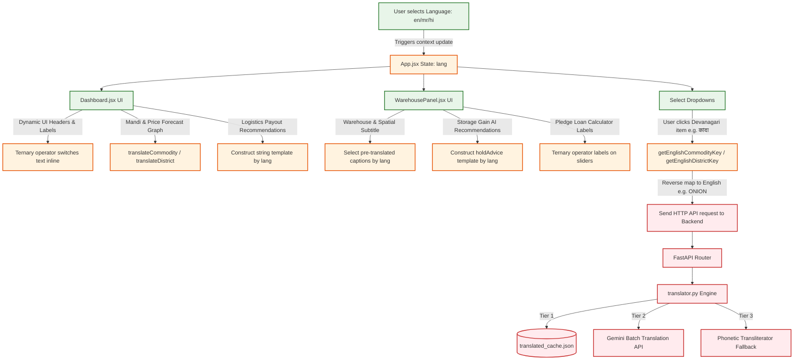

# Multilingual Translation & Transliteration Architecture

This document details the design and implementation of the multilingual localization system in Project Sahyadri 2.0. It explains how language selections are handled on the client side, panel-specific rendering logic for the Market Dashboard and Warehouse components, and how dynamic translation pipelines operate on the backend.

---

## 1. End-to-End Localization Workflow

The system is designed to support **English (`en`)**, **Marathi (`mr`)**, and **Hindi (`hi`)** across all interface panels, chatbot dialogue, and database reports.



---

## 2. Front-end Translation Logic

The frontend utilizes a lightweight, static translation dictionary defined in [translations.js](file:///c:/Users/Shashank/OneDrive/Desktop/data_sets_fetched/market_and_transaction_data/frontend/src/utils/translations.js):

### A. Dynamic Value Injection (`translateCommodity` / `translateDistrict`)
* **Purpose:** Converts raw database string responses (e.g., `"PIGEON PEA"`, `"DHARASHIV"`) into localized representations (e.g., `"तूर (अरहर)"`, `"धाराशिव"`) based on the active `lang` state.
* **Mechanism:** Searches `COMMODITY_MAP[lang][key]` falling back to English if the translation is undefined.

### B. Reverse Key Translation (`getEnglishCommodityKey` / `getEnglishDistrictKey`)
* **The Problem:** The underlying databases (SQLite / PostgreSQL) are keyed strictly in English uppercase terms (e.g., `SOYABEAN`, `LATUR`). If the frontend queries the API using Devanagari characters (e.g., `/api/forecast?commodity=सोयाबीन`), the query returns no database matches.
* **The Solution:** When a farmer selects a crop from the translated dropdown:
  1. The select component receives `"सोयाबीन"`.
  2. The function `getEnglishCommodityKey("सोयाबीन", "mr")` scans the dictionary values.
  3. It matches the value and extracts the key: `"SOYABEAN"`.
  4. The frontend sends the safe English key to the API, preventing query errors.

---

## 3. Panel-Specific Localization (Dashboard & Warehouse)

Rather than translating full sentences word-for-word, the React panels structure text elements using inline language toggles and pre-written multilingual templates:

### A. Market Dashboard ([Dashboard.jsx](file:///c:/Users/Shashank/OneDrive/Desktop/data_sets_fetched/market_and_transaction_data/frontend/src/components/Dashboard.jsx))
* **Dropdown Selects & Charts:** Chart legends and dropdown lists utilize `translateCommodity(c, lang)` to render inputs dynamically.
* **Conditional Text Templates:** Informational guidelines (like logistics descriptions) are built conditionally to match grammar rules:
  ```javascript
  lang === 'mr'
    ? `आपल्या ${translateDistrict(district, lang)} जिल्ह्यावरून ${item.market_name} पर्यंत ${item.recommended_vehicle} हे वाहन शिफारसित आहे...`
    : lang === 'hi'
    ? `अपने ${translateDistrict(district, lang)} जिले से ${item.market_name} तक ${item.recommended_vehicle} वाहन अनुशंसित है...`
    : `Recommended route from ${translateDistrict(district, 'en')} to ${item.market_name} using a ${item.recommended_vehicle}...`
  ```
* **Dataset Warning Fallbacks:** No-data alerts check the active language to explain dataless intervals in Devanagari script:
  ```javascript
  lang === 'mr'
    ? `निवडलेल्या '${translateCommodity(commodity, lang)}' पीक आणि '${translateDistrict(district, lang)}' जिल्ह्यासाठी माहिती उपलब्ध नाही.`
    : lang === 'hi'
    ? `चुने गए '${translateCommodity(commodity, lang)}' जिंस और '${translateDistrict(district, lang)}' जिले के लिए डेटा उपलब्ध नहीं है.`
    : `We couldn't find transactional market records for '${translateCommodity(commodity, lang)}' in '${translateDistrict(district, lang)}'.`
  ```

### B. Warehouse & Spatial Panel ([WarehousePanel.jsx](file:///c:/Users/Shashank/OneDrive/Desktop/data_sets_fetched/market_and_transaction_data/frontend/src/components/WarehousePanel.jsx))
* **Subtitle Localization:** Page descriptions dynamically load local maps based on user language preferences:
  ```javascript
  mr: `${translateDistrict(district, 'mr')} जिल्ह्यांतर्गत अधिकृत वखारी, सहकारी बँक शाखा आणि केव्हीके सल्ला केंद्रे.`,
  hi: `${translateDistrict(district, 'hi')} जिले में अधिकृत वेयरहाउस, सहकारी बैंक शाखाएं और केवीके केंद्र।`
  ```
* **Storage Hold AI Suggestions:** The storage advice recommendations map the selected crop context inside Devanagari templates:
  ```javascript
  mr: `AI अंदाजानुसार पुढील महिनाभरात ${translateCommodity(commodity, 'mr')} दरात मोठी वाढ अपेक्षित आहे. माल साठवून अतिरिक्त नफा मिळवा.`,
  hi: `TFT पूर्वानुमानों के अनुसार अगले 30 दिनों में ${translateCommodity(commodity, 'hi')} की कीमतों में उछाल अनुमानित है।`
  ```
* **Slider Parameter Labels:** Labels for the Pledge Loan calculator (e.g. *Warehouse Rent*, *Interest Expense*, *Loan Amount*) are dynamically generated using ternary operators:
  `lang === 'mr' ? 'कर्ज रक्कम' : lang === 'hi' ? 'ऋण राशि' : 'Pledge Loan Amount'`

---

## 4. Back-end Dynamic Translation Engine

Because the database contains hundreds of unique commodities, variety sub-categories, and mandi branches, it is impossible to map them all statically on the client. 

To solve this, [translator.py](file:///c:/Users/Shashank/OneDrive/Desktop/data_sets_fetched/market_and_transaction_data/backend/app/utils/translator.py) implements a **3-Tier Dynamic Translation Pipeline**:

```
[ Request Translation of Batch Terms ]
                  |
                  v
       [ Tier 1: Check Cache ]
  - Checks translated_cache.json
  - Checks STATIC_FALLBACKS dictionary
                  |
         Is term cached?
         +----> YES ----> Return cached translation
         +----> NO  ----> Proceed to Tier 2
                  |
                  v
    [ Tier 2: Gemini LLM Infill ]
  - Group missing terms into JSON array
  - Call Gemini to translate to target language
                  |
        Did LLM succeed?
         +----> YES ----> Cache and return Devanagari translation
         +----> NO  ----> Proceed to Tier 3 (Offline fallback)
                  |
                  v
    [ Tier 3: Phonetic Transliterator ]
  - Splits text into tokens (handling hyphens, slashes)
  - Replaces mapped vocabulary (e.g., "APMC" -> "बाजार समिती")
  - Evaluates remaining characters using phonetic syllables
```

### Tier 1: Local Cache Lookup
To minimize API network latency, the service loads [translated_cache.json](file:///c:/Users/Shashank/OneDrive/Desktop/data_sets_fetched/market_and_transaction_data/backend/translated_cache.json) into memory during server boot. It checks this cache first.

### Tier 2: Gemini LLM Batch Translating
If a query contains un-translated terms (e.g., a newly added APMC mandi name or minor crop variety), the backend batches them into a single list and queries Gemini:
* **The prompt** instructs Gemini to return translation pairings in Devanagari script for the target language (Marathi or Hindi).
* The prompt enforces a strict JSON schema output format to ensure safe parsing.
* Once parsed, the terms are committed to `translated_cache.json` so they are never queried from the network again.

### Tier 3: Rule-Based Phonetic Transliteration Fallback
If the LLM is offline or configured without API keys:
1. **Word-for-Word Lookups:** Scans a vocabulary dictionary `WORD_TRANSLATIONS` to replace terms:
   * e.g., `"APMC"` $\rightarrow$ `"बाजार समिती"`, `"VEGETABLES"` $\rightarrow$ `"भाज्या"`, `"HUSKED"` $\rightarrow$ `"सोललेला"`.
2. **Tokenization:** Breaks the string by whitespace, hyphens, or parentheses.
3. **Phonetic Character Mapping:** Translates individual phonetic characters:
   * Maps character sequences (`SH` $\rightarrow$ `श`, `CH` $\rightarrow$ `च`, `BH` $\rightarrow$ `भ`, `A` $\rightarrow$ `ा`, `I` $\rightarrow$ `ि`, etc.).
   * This guarantees that a legible phonetic transliteration is always returned.
