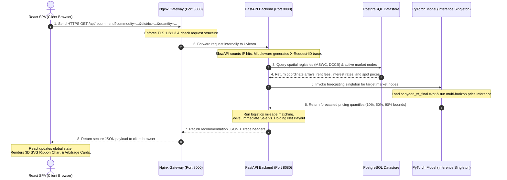

# Master Technical Presentation Deck & Technical Documentation Report
## Project Sahyadri 2.0: AI-Powered Multi-Horizon Price Forecasting & Spatial Arbitrage Recommendation System

This document contains a slide-by-slide outline for presentations alongside comprehensive technical documentation detailing the software engineering, mathematical foundations, and security layers of Project Sahyadri 2.0.

---

# PART 1: Slide-by-Slide Presentation Outline

## Slide 1: Title & Project Overview
* **Slide Title:** Project Sahyadri 2.0: AI-Powered Multi-Horizon Price Forecasting & Spatial Arbitrage Recommendation System
* **👶 Beginner Analogy:**
  > *"Imagine you are a farmer with a truck full of harvested crops. You want to sell them for the highest price, but you don't know if you should sell today at the local market down the street, or wait a few weeks and drive to a bigger market in the next town. Sahyadri 2.0 is a smart digital advisor that tells you exactly when, where, and how to sell to make the most money."*
* **⚙️ Technical Focus:**
  * **Core Concept:** A unified agricultural decision engine fusing deep learning (Temporal Fusion Transformer), spatial database networks, and voice-enabled conversational interfaces.
  * **Key Technologies:** FastAPI backend, PyTorch forecasting model, PostgreSQL database, Nginx security proxy, and Vite+React frontend SPA.

---

## Slide 2: The Post-Harvest Decision Problem
* **Slide Title:** Overcoming Post-Harvest Information Asymmetry & Distress Selling
* **👶 Beginner Analogy:**
  > *"Farmers face a two-sided puzzle every season: When should I sell, and where should I sell? Right now, they try to solve this by looking at outdated paper notices, listening to the radio, or asking neighbors. Because they lack immediate cash, they often engage in 'distress selling'—selling their hard work immediately for a low price."*
* **⚙️ Technical Focus:**
  * **Data Fragmentation:** Fuses fragmented domains (spot prices, meteorological forecasts, warehouse storage availability, logistics truck pricing, bank credit lines).
  * **Distress Selling Mitigation:** Calculates low-interest **Warehouse Receipt Loans** from DCCB cooperative banks to provide cash advances, enabling farmers to hold crops during seasonal price drops.
  * **Financial Impact:** Resolves state-scale losses of **₹500 to ₹1,500 per quintal** on sub-optimal crop sales.

---

## Slide 3: Raw Datasets Ingestion & Seeding
* **Slide Title:** High-Performance Ingestion Pipeline & Parquet Conversion
* **👶 Beginner Analogy:**
  > *"Before cooking a big dinner, you need to collect ingredients from different grocery stores and chop them up so they are ready to cook. We fetch millions of raw transaction logs from databases and pack them tightly into a single compressed 'Parquet' file so our computer can read them in seconds."*
* **⚙️ Technical Focus:**
  * **Elasticsearch Retrieval:** Fetches transactional logs from the **MahaAgriExchange (MahaAgX)** portal.
  * **The 3 Market Datasets:**
    * *Daily APMC Market Spot Prices* (MahaAgX ID: `09739e2a-d809-11f0-b972-af914ab1614f`)
    * *Private Mandi Spot Price Receipts* (MahaAgX ID: `474b0c02-cfb8-4a33-8d6e-2f419a0c847e`)
    * *Agro-Industrial Direct Transactions* (MahaAgX ID: `7676296a-2d0c-4abb-b7db-a366795e8bb6`)
  * **Data Consolidation:** Saves over **3.1 Million (31 Lakh) rows** into a column-oriented `sahyadri_dataset.parquet` file for high-speed I/O during model training.
  * **Spatial Registries Ingestion:** Swaps GeoJSON coordinate axes from standard WGS84 `[longitude, latitude]` to map order `[latitude, longitude]`. Establishes warehouse capacity rent tiers (₹10 - ₹15 per quintal/month) and bank branch lending interest rates (7.0% - 7.9% p.a.) using MD5 branch name hashing:
    $$\text{interest\_rate} = 7.0\% + (\text{MD5}(\text{bank\_name} + \text{branch\_name}) \bmod 10) \times 0.1\%$$

---

## Slide 4: Data Preprocessing & Sequence Preloading
* **Slide Title:** Preprocessing, Sunday Resampling & Gap-Filling
* **👶 Beginner Analogy:**
  > *"Our smart price-predicting computer needs to look at data points that are perfectly lined up week-by-week. If a market was closed on a holiday, we fill that gap with the last known price. We also divide information into things that never change (like the crop type) and things that change constantly (like price and volume)."*
* **⚙️ Technical Focus:**
  * **Sunday Date Rounding:** Standardizes daily timestamps to Sunday weekly dates:
    $$\text{week\_date} = \text{date} + ((6 - \text{weekday}) \bmod 7)\text{ days}$$
  * **Sequence Cleansing:** Drops outliers where price $\le$ ₹100/qtl. Gaps are forward-filled (`ffill`) for prices and zero-filled (`0.0`) for quantities.
  * **Sequence Length Filter:** Drops sequences shorter than 15 weeks to guarantee high-quality training history.
  * **Feature Partitioning:**
    * *Static Categoricals:* `commodity`, `district`, `source_type`, `market_name`.
    * *Time-Varying Known Categoricals:* `month`.
    * *Time-Varying Known Reals:* `time_idx` (elapsed week index).
    * *Time-Varying Unknown Reals:* `modal_price` (target), `quantity` (volume), `volatility_4w`.

---

## Slide 5: Model Selection: Why TFT? (ARIMA vs. LSTM vs. TFT)
* **Slide Title:** Model Selection: Why Temporal Fusion Transformer (TFT)?
* **👶 Beginner Analogy:**
  > *"Instead of using a simple calculator that only looks at one crop's past prices (ARIMA) or an AI memory loop that gets confused by details (LSTM), we use a state-of-the-art Google neural model (TFT). It acts like a chess grandmaster, weighing static facts like location alongside dynamic events like rainfall and transaction volumes, while highlighting exact historical cycles to predict future outcomes."*
* **⚙️ Technical Focus:**
  * **ARIMA Rejection:** Univariate and linear. Cannot incorporate static categories (crop type, district) or dynamic external variables (rainfall, volume). Requires training thousands of separate models.
  * **LSTM Rejection:** Suffers from sequential memory decay (forgets older seasonal cycles) and accumulates prediction errors recursively over multi-horizon forecasts. Acts as an uninterpretable "black box."
  * **TFT Selection:** Fuses multi-head self-attention with Gated Residual Networks (GRN) and Variable Selection Networks (VSN). Natively handles multivariate inputs, prevents error propagation, provides quantile-based uncertainty ranges, and is fully interpretable.

---

## Slide 5.1: Capturing Crop-Specific Seasonality
* **Slide Title:** How the AI Captures Monsoon, Winter & Summer Harvest Cycles
* **👶 Beginner Analogy:**
  > *"Crops don't grow the same way all year. A soybean farmer harvests in winter, while a wheat farmer harvests in summer. Our AI uses static 'crop labels' and calendar months like a seasonal calendar. It automatically understands that the same crop will follow its own repeating planting-and-harvest cycle year after year."*
* **⚙️ Technical Focus:**
  * **Known Future Features:** Feeds calendar `month` (1-12) directly into the forecasting decoder as a known future input to align prediction time steps with seasonal weather periods.
  * **Static Entity Gating:** Passes static embedding vectors (`commodity`, `district`) through Variable Selection Networks (VSN) to customize seasonal weights. (e.g. for `SOYABEAN`, it weights October/November harvest price drops; for `WHEAT`, it weights March/April drops).
  * **Temporal Self-Attention Alignment:** Multi-Head Attention layers learn to focus directly on historical sequences at exact annual offsets ($t-52$ and $t-104$ weeks), bypassing sequential memory decay.
  * **Rule-Based Fallback:** Applies offline crop-calendar multipliers (e.g., deducting 7-10% during supply gluts) when history is insufficient.

---

## Slide 6: Database Setup & Migration
* **Slide Title:** Spatial Infrastructure Registries & psycopg2 Bulk Database Migration
* **👶 Beginner Analogy:**
  > *"When our website gets busy with thousands of farmers searching for prices at the same time, a local file-based database can slow down. We build a high-speed pipe that streams over 3 million rows to a server-grade database in under 5 minutes without crashing."*
* **⚙️ Technical Focus:**
  * **Target Database:** PostgreSQL port 5432.
  * **Bulk Streaming Engine:** Streams SQLite rows to PostgreSQL in chunks of **25,000 rows** (`CHUNK_SIZE`) using `psycopg2.extras.execute_values()`.
  * **Migration Speed:** Exceeds **10,000+ rows/second** (migrating the 3.1M+ rows in under 5 minutes).
  * **Cascading Truncation:** Drops and truncates target Postgres tables utilizing `CASCADE` to prevent foreign key constraint exceptions.
  * **Postgres Indices:** Creates indexes `idx_transactions_comm_dist`, `idx_transactions_source_market`, and `idx_transactions_date`.
  * **Coordinate Fallback Engine:** Resolves missing coordinates to district centroid arrays or defaults to state coordinates `[19.7515, 75.7139]`.

---

## Slide 7: Backend Server & Security Gateway
* **Slide Title:** FastAPI ASGI Server Stack & Security Middlewares
* **👶 Beginner Analogy:**
  > *"Our server is like a secure bank lobby. It has a guard at the door (Nginx) to encrypt data, a visitor limit counter (SlowAPI) to prevent overcrowding, and a guest logger that gives every visitor a unique badge number (Request ID) to trace their actions."*
* **⚙️ Technical Focus:**
  * **ASGI Server Stack:** FastAPI server run by Uvicorn. Enables production SSL/TLS encryption using `sahyadri.crt` and `sahyadri.key` on Port 8000.
  * **Rate Limiting Protection:** Capped globally per client IP via SlowAPI utilizing a Redis caching backend with in-memory fallback.
  * **HTTP Tracing Middleware:**
    * Injects a unique UUID string (`X-Request-ID` header) into every request trace.
    * Computes precise request processing durations (`X-Process-Time` header).
    * Server Masking: Sets header to `Server: Sahyadri Secure Shield` and masks unhandled exceptions in production.

---

## Slide 8: HTTPS & Nginx Reverse Proxy
* **Slide Title:** Network Ingress Control & Nginx Configuration Block
* **👶 Beginner Analogy:**
  > *"Nginx acts like a strict security gateway standing outside our app server. It makes sure all client connections use secure HTTPS encryption, hosts the static React website files directly for super-fast loading, and proxies API queries to the backend database server."*
* **⚙️ Technical Focus:**
  * **Proxy Server:** Nginx listening on Port 8000. Restricts handshakes to TLS 1.2 and 1.3.
  * **Static File Hosting:** Directly serves compiled React files from root, reducing CPU load on the FastAPI ASGI server.
  * **Proxy Routing Configuration:** Forwards `/api/` traffic downstream to the internal backend container, passing variables (`Host`, `X-Real-IP`, `X-Request-ID`).

---

## Slide 9: React Single-Page Application (Frontend)
* **Slide Title:** Vite + React SPA & Stacking Context (z-Index) Resolution
* **👶 Beginner Analogy:**
  > *"Instead of showing farmers boring columns of numbers, we draw a colorful, twisting 3D highway on their screen. The height of the highway shows the future price, and the depth shows different markets. We also add slide controls that instantly recalculate storage loans."*
* **⚙️ Technical Focus:**
  * **Front-end Stack:** Single Page Application (SPA) built using Vite and React.
  * **Styling Theme:** Custom glassmorphism, responsive desktop sidebars, and mobile bottom menus written in Vanilla CSS.
  * **z-Index Elevation:** Solves container clipping on custom select panels by toggling triggered component wrappers dynamically (`z-50` when open, `z-20` when closed).
  * **Shared Context:** Shares active context parameters (`commodity`, `district`, `gpsCoords`) globally across all tabs in `App.jsx`.

---

## Slide 10: Connection Layer & API Catalog
* **Slide Title:** The API Interface - Bridge Between Client and Server
* **👶 Beginner Analogy:**
  > *"The frontend dashboard and the backend server talk to each other using a special telephone system called APIs. We have exactly 8 API lines in our system. Each line has a specific job, like asking for weather, fetching price forecasts, or asking the AI chatbot a question."*
* **⚙️ Technical Focus:** Exposes **exactly 8 core API endpoints** to connect the React UI with the FastAPI backend.

---

# PART 2: Core Architecture & Components Details

## 2.1 The Post-Harvest distress & Arbitrage Problem Statement

Smallholder farmers in India suffer from severe **post-harvest income leakage** due to a combination of:
1. **Information Asymmetry:** Farmers lack real-time spot and future price visibility across competing market channels (APMC mandis, private markets, and corporate direct-buyers).
2. **Lack of Storage Financial Buffer:** Due to urgent cash needs (repaying crop loans, buying seeds for the next cycle), farmers engage in **distress selling** immediately after harvest, when supply is highest and prices are lowest.
3. **Logistics Friction:** Farmers cannot calculate whether the transport fees to a higher-paying distant market will cancel out the arbitrage profit.

### The Solution: Project Sahyadri 2.0
We build an integrated tool that:
* **Predicts Price Trends:** Uses a Temporal Fusion Transformer (TFT) to forecast prices 7, 14, and 30 days ahead, complete with uncertainty boundaries.
* **Optimizes Logistics:** Evaluates quantities and selects the most economical transport vehicle (Mini Pickup, Pickup Truck, Medium Truck, Heavy Truck, or Tractor+Trolley), factoring in diesel costs, toll gates, and APMC fees.
* **Finances Holding Periods:** Integrates MSWC warehouses and DCCB bank branches to simulate **Pledge Financing (Warehouse Receipt Loans)**, demonstrating how a small bank loan allows the farmer to store crops, wait for prices to rise, and secure a higher net return.

---

## 2.2 Data Cleaning & Feature Engineering Pipeline

Agricultural market data is highly irregular and noisy. Our data cleaning pipeline transforms raw daily transaction logs into structured, sequential datasets ready for deep learning training.

### A. Cleaning Steps
1. **Weekly Resampling**: Daily market prices fluctuate wildly due to local conditions. We align all records to a weekly Sunday grid:
   $$\text{week\_date} = \text{date} + ((6 - \text{weekday}) \bmod 7)\text{ days}$$
2. **Outlier Filtering**: Truncates rows where `modal_price` is less than or equal to ₹100/quintal (indicating typographical errors or incomplete transaction logs).
3. **Missing Value Resolution (Gap-Filling)**:
   * **Prices (`modal_price`, `min_price`, `max_price`):** Forward-filled (`ffill`) from the last active trading week, assuming the price remains stable during market closures.
   * **Quantities (`quantity`):** Filled with `0.0`, representing zero trading volume.
4. **Sequence Filtering**: Sequences containing fewer than 15 consecutive weeks of history are dropped to prevent the deep learning model from learning from sparse, unstable time-series groups.

### B. Feature Engineering
We partition engineered features into four distinct categories required by the Temporal Fusion Transformer:
* **Static Categorical Variables:** `commodity`, `district`, `source_type`, `market_name`. (TFT creates high-dimensional vector embeddings for these static nodes).
* **Time-Varying Known Categoricals:** `month` (captures seasonal patterns).
* **Time-Varying Known Reals:** `time_idx` (a continuous integer incrementing by 1 each week, mapping time chronologically).
* **Time-Varying Observed (Unknown) Reals:**
  * `modal_price` (the target variable).
  * `quantity` (weekly transaction volume).
  * `volatility_4w` (4-week rolling standard deviation of the price, capturing market risk).

---

## 2.3 Deep Learning Forecasting: Why TFT? (ARIMA vs. LSTM vs. TFT)

Selecting the right forecasting model is critical to ensuring recommendation reliability. We evaluated three modeling paradigms:

### A. Model Evaluation Comparison

| Parameter | ARIMA *(AutoRegressive Integrated Moving Average)* | LSTM *(Long Short-Term Memory)* | TFT *(Temporal Fusion Transformer - Used)* |
| :--- | :--- | :--- | :--- |
| **Model Type** | Classical Linear Statistical Model | Sequential Deep Learning (RNN-based) | Modern Attention-Based Deep Learning |
| **Data Inputs** | **Univariate only** (looks only at past prices of the single target series). | **Multivariate** (can process price, volume, and external variables). | **Multivariate & Heterogeneous** (natively handles static facts and dynamic inputs). |
| **Handling Static Metadata** | ❌ **No**. Ignored completely. | ❌ **Poor**. Requires manual flattening and appending to sequence inputs. |  **Excellent**. Uses Variable Selection Networks (VSN) to build embeddings for static attributes. |
| **Seasonal Cycles** | ⚠️ **Limited**. Captures only rigid, pre-defined mathematical cycles. | ⚠️ **Medium**. Retains cycles via sequential memory, but decays over long horizons. |  **Superb**. Uses Multi-Head Self-Attention to focus directly on seasonal events in the past. |
| **Multi-Horizon Forecasts** | ⚠️ **Recursive**. Forecasts step-by-step; errors propagate rapidly. | ⚠️ **Recursive**. Suffers from error accumulation across multiple steps. |  **Direct**. Built natively to forecast multiple steps ahead (7, 14, 30 days) simultaneously. |
| **Uncertainty Quantification** | ❌ **No**. Single point forecast. | ❌ **No**. Single point forecast. |  **Yes**. Uses Quantile Loss to generate 10th, 50th, and 90th percentile bounds. |
| **Interpretability** |  **Yes**. Simple mathematical weights. | ❌ **No**. Completely uninterpretable "black box." |  **Yes**. Natively outputs attention weights, showing feature and time step importance. |

### B. The Core Mathematical Difference: Memory vs. Attention
* **LSTM (Sequential Memory Decay):** LSTMs process sequence steps sequentially, compressing historical data into a fixed-size hidden state vector $h_t$. Over long sequences (e.g., 52 weeks), the details of older steps decay exponentially. By the time the model processes week 52, it has "forgotten" the specific details of week 1 (the corresponding seasonal harvest window of the prior year).
* **TFT (Self-Attention Highlight):** The Temporal Fusion Transformer utilizes self-attention mechanisms. It computes attention weights between the current time step and *all* historical time steps simultaneously. If the model is forecasting a price for October, the attention mechanism assigns high weights directly to the historical data from the previous October, bypassing irrelevant intermediate months and preventing memory decay.

### C. Capturing Crop-Specific Seasonality (Monsoon, Winter, Summer & Harvest Cycles)

Agricultural markets in India are heavily dependent on meteorological seasons: the monsoon (Rainy: June–September), post-monsoon harvest (Winter: October–January), and dry summer (March–May). Different crops follow distinct crop calendars (Kharif vs. Rabi vs. Zaid crops). The unified architecture captures this complex seasonality through four key mechanisms:

1. **Monsoon/Season Tracking via Time-Varying Known Inputs:**
   * The calendar `month` (1-12) is marked as a **Time-Varying Known Categorical** feature. 
   * Because calendar months are deterministic and known in advance, they are fed directly into the model's **Decoder** layers for the future 4-week forecast horizon.
   * This allows the model to anticipate upcoming seasonal shifts (e.g., entering the monsoon or winter harvest) before they occur in the transaction data.

2. **Entity-Specific Seasonality Gating (Variable Selection Networks):**
   * Crop seasonality is not uniform; Soyabean (Kharif) and Wheat (Rabi) have opposite harvest calendars.
   * The TFT utilizes **Variable Selection Networks (VSN)** combined with **Static Entity Embeddings** (`commodity`, `district`).
   * When static features like `commodity="SOYABEAN"` are fed into the network, they pass through Gated Residual Networks (GRN) to act as static context vectors.
   * These vectors modulate the temporal self-attention weights. Consequently, the model learns *commodity-specific seasonal rules*:
     * **Soyabean (Kharif):** Sown in the rainy season (June), harvested in October/November. The model recognizes that when `commodity` is `SOYABEAN` and `month` is `10` or `11`, arrivals peak (supply glut) and price trajectories face downward pressure.
     * **Wheat (Rabi):** Sown in winter (November), harvested in summer (March/April). The model learns to expect a price dip and quantity surge during months `3` and `4` instead.
     * **Onion (Bi-modal Harvests):** Captured natively as two seasonal harvest dips (March–April and October–November).

3. **Multi-Head Self-Attention Alignment:**
   * Instead of compressing all past weeks sequentially, the self-attention heads calculate weights directly comparing the prediction step with historical steps.
   * During training, the attention heads learn to place high activation weights on steps at exact offsets of $t-52$ (1 year ago) and $t-104$ (2 years ago). This allows the network to compare current market trajectories directly with historical yearly seasonal cycles.

4. **Rule-Based Seasonal Fallback Engine:**
   * If a market sequence is too short ($< 6$ weeks) and the TFT is bypassed, the backend uses a deterministic rules engine.
   * This engine fits a linear slope to historical prices and overlays a **crop-specific seasonality coefficient** based on the official crop calendar in Maharashtra (e.g. subtracting 7% to 10% during peak harvest seasons to simulate supply saturation, and adding 10% during off-harvest scarcity months).

### D. Beginner-Friendly Seasonality Analogy: The Farmer's Multi-Crop Diary

To explain how this seasonality logic works to a non-technical audience (such as investors, farmers, or project coordinators), you can use this simple **"Four-Part Diary" Analogy**:

1. **The Smart Wall Calendar (Knowing Future Months):**
   * *The Problem:* Traditional forecast systems look *only* at past prices. If Cotton was ₹6,000 last week, it might guess ₹6,100 next week, without realizing that winter is ending and the harvest season is over.
   * *Our Solution:* Imagine a farmer who has a wall calendar. They look ahead and see **October** approaching. Even if they are currently in September, they *know* October is coming.
   * *How the AI does it:* The AI is explicitly given the future calendar months for the weeks it is predicting. It knows which month is coming next, allowing it to prepare for known seasonal weather patterns (Monsoon, winter, summer) and festivals.

2. **The "Crop Selector" Switch (Modulating by Crop Type):**
   * *The Problem:* Not all crops grow at the same time. **Soybeans** are harvested in October/November (Kharif crop), while **Wheat** is harvested in March/April (Rabi crop). A simple AI model gets confused because it tries to apply the same October rule to everything.
   * *Our Solution:* Imagine our farmer has separate diaries for Soybeans and Wheat. For Soybean, October is marked with a big red stamp: **"HARVEST TIME - PRICE DROPS!"** For Wheat, March is marked instead.
   * *How the AI does it:* The AI has static embeddings for crops. When you choose `SOYABEAN`, it automatically switches on the "Soybean Seasonal Behavior Calendar." This calendar instructs the neural networks to watch for supply gluts and price drops in October. When you select `WHEAT`, the AI dynamically adjusts its focus to expect drops in March/April.

3. **The Highlighted Index (Self-Attention vs. Memory Loops):**
   * *The Problem:* Traditional AI models (LSTMs) read history step-by-step like a book, trying to memorize everything. By the time they reach year 5, they've forgotten what happened in year 1.
   * *Our Solution:* Imagine our farmer does not try to memorize 5 years of daily transactions. Instead, when they want to predict Cotton prices for this coming November, they open their diary and flip **directly** to the page for **November of last year** and **November of two years ago**. They look at those highlighted sections to see exactly how prices behaved.
   * *How the AI does it:* The model uses **Self-Attention**. It calculates direct links to the exact same calendar week of the previous years ($t-52$ and $t-104$ weeks), bypassing sequential memory dilution.

4. **The Senior Farmer's Rule-of-Thumb (The Fallback Engine):**
   * *The Problem:* If a farmer moves to a new village or starts selling a new crop, their diary has only 2 weeks of prices. They cannot look back at last year.
   * *Our Solution:* The junior farmer asks a senior farmer in the village: *"What usually happens to prices here?"* The senior farmer replies: *"Well, generally, whatever the current price is, it drops by about 10% during peak harvest season because the market is flooded."*
   * *How the AI does it:* If a crop in a specific market has less than 6 weeks of data, the AI cannot run the complex neural network. Instead, it activates the **Rule-Based Fallback**. It fits a linear trend to the recent weeks and applies a hardcoded crop calendar percentage (e.g. subtract 10% in harvest peak, add 10% off-season) to give the farmer a reliable forecast.

---

## 2.4 How the Backend Works: Databases, API, and Security Layers

The backend architecture is built to handle high concurrency, run deep learning inference, and secure communication channels.

```
+-------------------------------------------------------------------------------------------------+
|                                     PRODUCTION SECURITY SHIELD                                  |
|                                                                                                 |
|  [ Client Browser ] --- (Port 8000: Nginx SSL / HTTPS) ---> [ SlowAPI Limiter ] ---> [ JWT Lock ]|
+-------------------------------------------------------------------------------------------------+
                                                                 |
                                                                 v
+-------------------------------------------------------------------------------------------------+
|                                       FASTAPI CORE ROUTER                                       |
|                                                                                                 |
|  [ Middleware: Trace & Server Mask ] ---> [ /api/recommend ] ---> [ Postgres DB ] ---> [ TFT ]  |
+-------------------------------------------------------------------------------------------------+
```

### A. Database Migration & Optimization
* **Dual Database Schema:** Development runs on SQLite (`sahyadri_data.db`), while production scales on PostgreSQL.
* **Bulk Migration Engine (`migrate_sqlite_to_pg.py`):** Transfers over 3.1 Million records in under 5 minutes.
  * **psycopg2 Extras:** Employs `psycopg2.extras.execute_values()` to insert rows in chunks of **25,000** (`CHUNK_SIZE`).
  * **Throughput:** Exceeds **10,000+ rows per second**.
  * **Indices Created:**
    * `idx_transactions_comm_dist` on `(commodity, district)`
    * `idx_transactions_source_market` on `(source_type, market_name)`
    * `idx_transactions_date` on `(date)`
* **Centroid Fallback:** For spatial queries where coordinate rows are null, the database utilizes `location_coords.json` coordinates or defaults to district/state centroids `[19.7515, 75.7139]` to avoid runtime location crashes.

### B. Security & HTTPS Network Layer (The 4 Security Shields)
1. **Nginx SSL/TLS Reverse Proxy Gateway:** 
   * In production, Nginx listens on port 8000. It enforces secure SSL communication using self-signed certificates (`sahyadri.crt` and `sahyadri.key`).
   * It terminates the SSL wrapper and forwards traffic to the internal Uvicorn ASGI server.
   * It restricts SSL handshakes strictly to **TLS 1.2** and **TLS 1.3** to block legacy cipher exploits.
2. **SlowAPI Rate Limiter:**
   * Protects the application from DoS/DDoS attacks and bot scraper exploitation.
   * Links to a Redis container (`redis://localhost:6379/0`) to count requests per client IP, falling back to local memory if Redis goes offline.
   * Blocks clients exceeding limits (e.g. max 15 chat queries/minute) with a `429 Too Many Requests` error.
3. **JWT Token-Based Authentication:**
   * Private dialog agent (`/api/chat`) and diagnostic endpoints (`/api/upload-image`) require a verified JSON Web Token passed in the `Authorization: Bearer <JWT>` header.
   * Restricts computationally expensive Gemini AI calls to authorized clients.
4. **FastAPI Request Tracing Middleware:**
   * **UUID Trace Injection:** Appends a unique `X-Request-ID` header to every response, matching backend execution logs for auditing.
   * **Performance Monitoring:** Injects `X-Process-Time` showing processing speeds.
   * **Server Masking:** Overrides default headers to return `Server: Sahyadri Secure Shield` to hide backend stack details.
   * **Unhandled Exception Masking:** Catches uncaught crashes in production, returns generic error messages with request IDs, and masks internal system codes:
     ```json
     {"detail": "An internal server error occurred.", "request_id": "uuid-..."}
     ```

---

## 2.5 The API Connection Catalog (The 8 Core Endpoints)

The React client interacts with the FastAPI backend through **exactly 8 core API endpoints**:

### 1. Diagnostic Probe (`GET /api/health`)
* **Purpose:** Monitor system health.
* **Backend Processing:** Checks SQLite/PostgreSQL connection pools, pings Redis, and verifies TFT model weights are loaded.
* **Output Payload:**
  ```json
  {"status": "healthy", "database": "up", "redis": "up", "tft_model": "loaded", "timestamp": 1780458992.12}
  ```

### 2. Localization Suggest (`GET /api/suggest`)
* **Query Parameters:** `lang` (Preferred language, e.g. `mr`, `hi`, `en`).
* **Backend Processing:** Queries distinct commodities and districts. If `lang` is non-English, it batch-translates terms using cache or Gemini before compiling label pairs.
* **Output Payload:**
  ```json
  {"commodities": [{"value": "SOYABEAN", "label": "सोयाबीन"}], "districts": [{"value": "LATUR", "label": "लातूर"}], "gemini_active": true}
  ```

### 3. Price Forecasting (`GET /api/forecast`)
* **Query Parameters:** `commodity` (Crop), `district` (Region), `base_date` (Optional YYYY-MM-DD).
* **Backend Processing:** Queries latest record date, triggers TFT forecasting singleton, and yields price quantiles (10%, 50%, 90%) for days 0, 7, 14, and 30.
* **Output Payload:**
  ```json
  {
    "commodity": "SOYABEAN", "district": "LATUR", "base_date": "2026-05-24",
    "forecasts": [{"market_name": "Latur APMC", "source_type": "APMC", "forecasts": {"0": 4200, "7": 4280, "14": 4360, "30": 4520}}]
  }
  ```

### 4. Infrastructure Mapping (`GET /api/spatial`)
* **Query Parameters:** `district` (Region), `lang`, `latitude` (Optional Lat), `longitude` (Optional Lng).
* **Backend Processing:** Queries SQL tables for MSWC warehouses, DCCBs, soil labs, and KVKs matching the district aliases. Calculates Haversine distances to each and builds verified Google Maps Directions URLs.
* **Output Payload:**
  ```json
  {
    "warehouses": [{"plant_name": "Udgir Warehouse", "total_capacity": 5000, "rent_per_qtl_month": 12.0, "distance_km": 42.1, "maps_url": "https://www.google.com/maps/dir/?api=1..."}],
    "dccb_branches": [...], "soil_labs": [...], "kvk_stations": [...]
  }
  ```

### 5. Strategy Optimizer (`GET /api/recommend`)
* **Query Parameters:** `commodity`, `district`, `quantity` (Quintals), `lang`, `latitude` (GPS), `longitude` (GPS).
* **Backend Processing:** Matches local spatial lookup coordinates, pulls forecasts, runs transport vehicle mileage selection, calculates warehousing pledge finance loans, and optimizes Net Payout margins for immediate sell vs. holding.
* **Output Payload:**
  ```json
  {
    "commodity": "SOYABEAN", "strategy": "HOLD", "strategy_days": 30,
    "best_market": {"market_name": "Nanded APMC", "spot_price": 4200.0, "predicted_30d": 4520.0, "transport_cost": 2400.0, "profit_gain": 8600.0, "recommended_vehicle": "Pickup Truck"},
    "nearest_warehouse": {...}, "nearest_bank": {...}
  }
  ```

### 6. Secured Dialog Agent (`POST /api/chat`)
* **Auth Requirement:** JWT verification header.
* **Request Body:** `{ "text": "सोयाबीनचे भाव सांगा", "lang": "mr", "session_id": "uuid-1" }`.
* **Backend Processing:** Verifies user session, routes query tokens to the agent router, standardizes crop/district aliases, calls Gemini, and translates the response payload.
* **Output Payload:**
  ```json
  {"response": "🌾 सोयाबीन बाजार अपडेट...", "session_id": "uuid-1", "detected_entities": {"commodity": "SOYABEAN"}}
  ```

### 7. Crop Disease Diagnostics (`POST /api/upload-image`)
* **Auth Requirement:** JWT verification header.
* **Request Body:** Multipart Form Data (raw image file stream).
* **Backend Processing:** Reads raw image bytes, sends the stream to Gemini Vision, diagnoses disease path, and returns treatment remedies in the requested language.
* **Output Payload:**
  ```json
  {"diagnosis": "खोड पोखरणारी अळी (Stem Borer)", "remedy": "१. बाधित झाडे उपटून नष्ट करा. २. क्लोरँट्रानिलीप्रोल रासायनिक फवारणी करा."}
  ```

### 8. Speech Audio Generation (`GET /api/tts`)
* **Query Parameters:** `text` (Message to speak), `lang`.
* **Backend Processing:** Generates text-to-speech audio bytes using Google TTS synthesis engine.
* **Output Payload:** Binary MP3 audio stream (`StreamingResponse`, `media_type="audio/mpeg"`).

---

## 2.6 Frontend Single-Page Application (Vite + React)

The frontend client is built as a highly responsive Single-Page Application (SPA) optimized for mobile and desktop screens.

### A. Responsive Grid Layout & Styles
* **Dev Stack:** Vite compiling React 18, styled using Vanilla CSS (`index.css` and `sahyadri-premium.css`).
* **Grid Layouts:** Employs a mobile-first responsive layout grid. Desktop views display a fixed sidebar navigation panel, while mobile views display a floating top header bar and a persistent bottom navigation menu.
* **Glassmorphic Design:** Implements modern card backgrounds, input glows, and spinning micro-animations (e.g. spinning weather icons).

### B. Global State Context Syncing
The application coordinates state parameters globally within `App.jsx`:
1. **Language State (`lang`):** Holds the display locale (`en`, `mr`, `hi`). 
2. **Context States (`commodity`, `district`, `gpsCoords`):** Modifying the selected crop or district in one panel instantly updates all other panels. For example, if a farmer enters "Soyabean price in Latur" in the Chat panel:
   * The Chatbot parses the input, updating the global states to `SOYABEAN` and `LATUR`.
   * Switching to the Dashboard or Warehouse panels immediately displays Soybean and Latur details.

### C. Stacking Context (z-Index) Resolution
To prevent custom dropdown selects (`SearchableSelect` React wrappers) from clipping behind card boundaries, wrappers toggle z-index rules dynamically:
* **Expanded:** `z-50 relative` (forces dropdown options to overlay all surrounding cards).
* **Collapsed:** `z-20 relative` (allows other UI components to render cleanly).

### D. SVG 3D Isometric Ribbon Price Chart
To compare multiple markets without visual clutter, `Dashboard.jsx` projects weeks ($x$), price ($y$), and market rank ($z$) onto a flat 2D canvas:
* **Isometric Projection Equations:**
  $$px = 75 + x \cos(12^\circ) + z \cos(-22^\circ)$$
  $$py = 155 - y + x \sin(12^\circ) + z \sin(-22^\circ)$$
* **Painter's Algorithm Depth-Sorting:** Sorts ribbons by rank and renders from back-to-front (Rank 2 first, Rank 0 last) to prevent overlap.
* **Cubic Bezier Curves:** Uses SVG `C` commands to smooth curves.

### E. Client-Side Recalculators
To maintain responsiveness, sliders for crop quantity and storage days compute estimations locally without calling backend APIs:
* $\text{Total Rent} = Q \times R_{rent} \times (D / 30)$
* $\text{Cooperative Loan} = Q \times P_{spot} \times LTV$
* $\text{Accrued Interest} = \text{Cooperative Loan} \times I_{rate} \times (D / 365)$

### F. Devanagari Reverse-Mapping Translator
Queries to the SQL databases require exact uppercase English names (e.g. `SOYABEAN`, `LATUR`). When the farmer selects a Devanagari label (e.g., `सोयाबीन`, `लातूर`), the translation helper `translations.js` maps the value back to its English database key prior to executing fetch requests.

---

# PART 3: Mathematical Arbitrage Optimization Solver

The backend recommendation solver calculates Net Revenue for every market node based on parameters supplied:

1. **Distance Modeling ($D$):**
   If browser GPS coordinates $(Lat_{user}, Lng_{user})$ are supplied, the geodesic distance ($D_{geo}$) is computed via the Haversine formula. A winding multiplier ($1.25$) is applied to simulate actual road travel:
   $$D = 1.25 \times D_{geo}$$
   Otherwise, the distance is matched against district centroid databases.

2. **Logistics Allocation & Fuel Cost ($C_{fuel}$):**
   A vehicle type is selected depending on the quantity ($Q$, in quintals) to be transported. Diesel price is fixed at **₹95.00/L**:
   * **Mini Pickup:** ($Q \le 10$ QTL) $\to$ Mileage $M = 12.0$ km/L
   * **Pickup Truck:** ($10 < Q \le 30$ QTL) $\to$ Mileage $M = 8.0$ km/L
   * **Medium Truck:** ($30 < Q \le 80$ QTL) $\to$ Mileage $M = 5.0$ km/L
   * **Heavy Truck:** ($80 < Q \le 200$ QTL) $\to$ Mileage $M = 4.0$ km/L
   * **Multi-Truck Heavy:** ($Q > 200$ QTL) $\to$ Mileage $M = 4.0$ km/L, where $N_{trucks} = \lceil Q / 200 \rceil$.
   
   $$\text{Diesel Cost } (C_{fuel}) = \left( \frac{D}{M} \right) \times 95.00 \times N_{trucks}$$

3. **Immediate Sale Net Revenue ($R_{immediate}$):**
   $$R_{immediate} = (P_{spot} \times Q) - C_{fuel} - \text{Mandi Fees}$$
   Where Mandi Fees depend on market type:
   * **APMC Mandi:** Toll = ₹0.00, Fee = ₹45.00/qtl
   * **Private Market:** Toll = ₹50.00, Fee = ₹20.00/qtl
   * **Corporate Buyer:** Toll = ₹90.00, Fee = ₹0.00/qtl

4. **Holding Sale Net Revenue ($R_{hold}(d)$) for $d$ days:**
   Let $P_{pred}(d)$ be the TFT model predicted price at day $d \in \{7, 14, 30\}$.
   Let $R_{rent}$ be the monthly warehouse rent per quintal.
   Let $I_{rate}$ be the bank's annual interest rate.
   Let $LTV$ be the loan-to-value ratio.
   
   * **Warehouse Storage Rent:**
   * **Net Payout:**
     $$R_{hold}(d) = (P_{pred}(d) \times Q) - C_{fuel} - \text{Rent}(d) - \text{Interest}(d) - \text{Mandi Fees}$$

   * **Optimization Decision:**
     The solver selects the day $d^* \in \{0, 7, 14, 30\}$ that maximizes the net payout. If $d^* = 0$, the strategy is `SELL_NOW`. If $d^* > 0$, the strategy is `HOLD` for $d^*$ days.

# PART 5: Unified System Architecture & Integration Specifications

Project Sahyadri 2.0's architecture is built on a modular, multi-tiered design where the user interface, backend micro-agents, relational database, deep learning models, and security layers form a single, unified system.

```
+--------------------------------------------------------------------------------------------------+
|                                  USER / CLIENT LAYER (Vite + React)                              |
|   - Multi-Tab State Syncing (App.jsx)              - 3D Isometric price ribbons (SVG Canvas)     |
|   - Client-side pledge loan calculations           - Devanagari translation reverse-mapping      |
+--------------------------------------------------------------------------------------------------+
                                                 │
                             HTTPS Request (Port 8000) with JWT Auth
                                                 ▼
+--------------------------------------------------------------------------------------------------+
|                                    SECURITY & PROXY LAYER (Nginx)                                |
|   - SSL/TLS Termination (TLS 1.2/1.3)              - Static File Caching                         |
|   - Request Routing (Downstream Proxy)             - CORS & Header Filtering                     |
+--------------------------------------------------------------------------------------------------+
                                                 │
                                           Internal Proxy
                                                 ▼
+--------------------------------------------------------------------------------------------------+
|                                     FASTAPI CORE ROUTER GATEWAY                                  |
|   - SlowAPI IP-Based Rate Limiting                 - Trace Log Injections (X-Request-ID)         |
|   - Error Masking Middleware                       - Thread-Clamped Inference Singleton          |
+--------------------------------------------------------------------------------------------------+
                                 │                               │
                      SQL Queries (Port 5432)        Forecasting Singleton Calls
                                 ▼                               ▼
+------------------------------------+       +------------------------------------+
|        RELATIONAL DATASTORE        |       |        DEEP LEARNING MODEL         |
|   - PostgreSQL Production Server   |       |   - PyTorch Model Singleton        |
|   - Index-Accelerated Lookups      |       |   - Multi-Horizon Quantile Loss    |
|   - Spatial centroid fallback      |       |   - sahyadri_tft_final.ckpt        |
+------------------------------------+       +------------------------------------+
```

## 5.1 Cross-Layer Architecture Synergies

1. **Context-Driven Flow Control:** 
   The application avoids redundant network roundtrips. When a farmer interacts with the UI (e.g., selecting a district or crop), the global context state updates inside `App.jsx`. All tabs instantly sync to this context. When a tab makes an API call, it passes this unified state, which the backend routes to the correct database queries.
2. **Double-Layered Intelligence Layer (LLM + Heuristics):** 
   The backend combines online deep reasoning (Gemini API) with local fallback execution (offline rules engines). If a weather forecast query is made and the Gemini token quota is exhausted, the backend seamlessly falls back to local rules-based advisory logic (heat-stress thresholding, rain-drainage guidelines) so the system remains functional.
3. **Decoupled Processing Singleton:** 
   Deep learning model execution (TFT PyTorch inference) is computationally heavy. If every incoming web thread executed the model concurrently, the CPU would thrash and the server would lag. The backend wraps the TFT model in a thread-clamped (`torch.set_num_threads(1)`) thread-safe singleton wrapper. All forecasting requests are piped through this singleton, preserving server stability.

## 5.2 The Unified End-to-End Data Lifecycle

The path of a single data query (e.g., a farmer asking for selling advice) illustrates how the unified architecture coordinates:



## 5.3 Multi-Container Deployment & Isolation Topology (Docker Compose)

In a production environment, the unified architecture is isolated into four distinct Docker containers managed by a single orchestrator (`docker-compose.yml`). This ensures fault isolation, security perimeters, and vertical scalability:

| Container Name | Technology Stack | Exposed Ports | Internal Communication | Primary Purpose |
| :--- | :--- | :--- | :--- | :--- |
| **`sahyadri-proxy`** | Nginx Alpine | `8000:8000 (HTTPS)` | Connects to `sahyadri-backend:8080` | Encrypts ingress traffic, terminates SSL/TLS, caches static assets, and masks backend endpoints. |
| **`sahyadri-backend`** | FastAPI + Uvicorn + PyTorch | None | Connects to `sahyadri-db:5432` and `sahyadri-cache:6379` | Executes business logic, runs TFT model singleton, routes requests, and manages conversational agents. |
| **`sahyadri-db`** | PostgreSQL 15 | None | Listens on `5432` (Only accessible by backend container) | Stores market transaction history, spatial registries, user profiles, and index matrices. |
| **`sahyadri-cache`** | Redis | None | Listens on `6379` (Only accessible by backend container) | Manages SlowAPI rate-limiting counters, caching translation records, and user session keys. |

# PART 6: Unified System Architecture Diagram

This end-to-end flowchart represents the unified technical architecture of Project Sahyadri 2.0:

```mermaid
graph TD
    %% Styling Classes
    classDef datastore fill:#e1f5fe,stroke:#0288d1,stroke-width:2px;
    classDef model fill:#fff3e0,stroke:#e65100,stroke-width:2px;
    classDef security fill:#ffebee,stroke:#c62828,stroke-width:2px;
    classDef controller fill:#f3e5f5,stroke:#7b1fa2,stroke-width:2px;
    classDef ui fill:#e8f5e9,stroke:#2e7d32,stroke-width:2px;
    classDef script fill:#f9fbe7,stroke:#afb42b,stroke-width:2px;

    %% A. DATA SOURCES & SEEDING LAYER
    subgraph Layer_A ["A. Data Ingestion & Seeding Pipeline"]
        S1["MahaAgX APMC Spot Prices JSON"]
        S2["Private Mandi Arrivals JSON"]
        S3["Agro-Industrial Direct Procurement JSON"]
        S4["MSWC Warehouse Registry (200 Godowns)"]
        S5["DCCB Bank Branch Directory (7,608 Branches)"]
        S6["MahaAGX_SoilLabs.geojson (873 Labs)"]
        
        SeedScript["ingest_spatial_data.py<br/>(Coordinate swapping [lng, lat] to [lat, lng])"]
        SQLite[(sahyadri_data.db SQLite)]
        
        S1 --> SeedScript
        S2 --> SeedScript
        S3 --> SeedScript
        S4 --> SeedScript
        S5 --> SeedScript
        S6 --> SeedScript
        SeedScript --> SQLite
    end
    class SQLite datastore;
    class SeedScript script;

    %% B. DATABASE MIGRATION ENGINE
    subgraph Layer_B ["B. High-Speed Production Migration"]
        MigrateScript["migrate_sqlite_to_pg.py<br/>(Batch Size: 25,000 | psycopg2 Bulk Streamer)"]
        Postgres[(PostgreSQL Production DB Port 5432)]
        
        SQLite --> MigrateScript
        MigrateScript -->|CASCADE Truncation & Bulk Stream| Postgres
    end
    class Postgres datastore;
    class MigrateScript script;

    %% C. DEEP LEARNING MODEL TRAINING (KAGGLER ENVIRONMENT)
    subgraph Layer_C ["C. Deep Learning forecasting Pipeline (Kaggle)"]
        ParquetExporter["sahyadri_exporter.py"]
        ParquetFile["sahyadri_dataset.parquet"]
        Kaggle["Kaggle GPU Accelerator<br/>(Dual Nvidia Tesla T4 GPUs)"]
        TFTModel["Temporal Fusion Transformer Training<br/>(Quantile Loss: 10%, 50%, 90% price boundaries)"]
        TFTCKPT["sahyadri_tft_final.ckpt"]
        
        SQLite --> ParquetExporter
        ParquetExporter --> ParquetFile
        ParquetFile --> Kaggle
        Kaggle --> TFTModel
        TFTModel -->|8 Epochs / 50,112 Steps| TFTCKPT
    end
    class ParquetFile datastore;
    class TFTCKPT model;
    class ParquetExporter script;

    %% D. PRODUCTION SECURITY SHIELDS
    subgraph Layer_D ["D. Access Security & Proxy Shields"]
        Nginx["Nginx Reverse Proxy<br/>(TLS 1.2/1.3, SSL, HSTS, CORS)"]
        SlowAPI["SlowAPI Rate Limiter<br/>(IP Capping via Redis storage)"]
        JWT["JWT Access Token Authenticator"]
        
        Client([Farmer Client Browser]) -->|HTTPS Request Port 8000| Nginx
        Nginx --> SlowAPI
        SlowAPI --> JWT
    end
    class Nginx,SlowAPI,JWT security;

    %% E. FASTAPI BACKEND APPLICATION SERVER & MICROSERVICES
    subgraph Layer_E ["E. FastAPI Application Server & Microservice Agents"]
        MainApp["main.py API Routes"]
        Middleware["Tracing Middleware<br/>(X-Request-ID, X-Process-Time, Server Header Masking)"]
        Router["router.py Chat Agent Router"]
        
        TFT_Inference["forecast_agent.py<br/>(TFT CPU Inference Singleton)"]
        RecAgent["recommend_agent.py (Solver)<br/>(Vehicle Logic, Fuel Math, Holding Payout Solver)"]
        WeatherAgent["weather_agent.py<br/>(Open-Meteo REST Client & Gemini LLM Advisors)"]
        DiseaseAgent["disease_agent.py<br/>(Gemini Vision Image Diagnostics)"]
        VoiceAgent["voice_agent.py<br/>(Google TTS MP3 Synthesis)"]
        
        JWT --> MainApp
        MainApp --> Middleware
        
        Middleware -->|GET /api/recommend| RecAgent
        Middleware -->|GET /api/forecast| TFT_Inference
        Middleware -->|GET /api/weather| WeatherAgent
        Middleware -->|POST /api/chat| Router
        Middleware -->|POST /api/upload-image| DiseaseAgent
        Middleware -->|GET /api/tts| VoiceAgent
        
        Router -->|Route dialog tokens| WeatherAgent
        Router -->|Route dialog tokens| DiseaseAgent
        Router -->|Route dialog tokens| TFT_Inference
        Router -->|Route dialog tokens| RecAgent
        
        TFTCKPT -->|Load Model Weights| TFT_Inference
        
        Postgres -->|Query markets, spatial registries| RecAgent
        Postgres -->|Query markets, spatial registries| WeatherAgent
        
        RecAgent -->|Fetch pricing ranges| TFT_Inference
    end
    class MainApp,Middleware,Router,TFT_Inference,RecAgent,WeatherAgent,DiseaseAgent,VoiceAgent controller;

    %% F. REACT SINGLE-PAGE APPLICATION (SPA CLIENT)
    subgraph Layer_F ["F. React Single-Page Application (Frontend Client)"]
        AppJS["App.jsx Router & Layout<br/>(Tab Swapping & Context State: Crop, Dist, GPS)"]
        AuthModal["AuthModal.jsx<br/>(JWT modal blocker)"]
        
        HomePanel["HomePanel.jsx<br/>(Greeting shortcuts)"]
        Dashboard["Dashboard.jsx<br/>(Logistics ledgers)"]
        WarehousePanel["WarehousePanel.jsx<br/>(Proximity cards list)"]
        WeatherPanel["WeatherPanel.jsx<br/>(Live weather status)"]
        ChatbotUI["ChatbotUI.jsx<br/>(Chat Assistant Container)"]
        
        RibbonChart["3D SVG Price Ribbon Canvas<br/>(Isometric projections & Painter's Algorithm depth sorting)"]
        PledgeCalc["Pledge Finance Local Estimator<br/>(Instant slider calculations: Rent, Loan, Interest)"]
        GMaps["Google Maps directions redirect<br/>(GPS coordinates to official Business listings)"]
        
        MainApp -->|Serve compiled React Bundle| AppJS
        AppJS --> AuthModal
        AppJS --> HomePanel
        AppJS --> Dashboard
        AppJS --> WarehousePanel
        AppJS --> WeatherPanel
        AppJS --> ChatbotUI
        
        Dashboard --> RibbonChart
        WarehousePanel --> PledgeCalc
        WarehousePanel --> GMaps
        ChatbotUI -->|Image Uploads & Audio Playback| AppJS
    end
    class AppJS,AuthModal,HomePanel,Dashboard,WarehousePanel,WeatherPanel,ChatbotUI,RibbonChart,PledgeCalc,GMaps ui;
```


