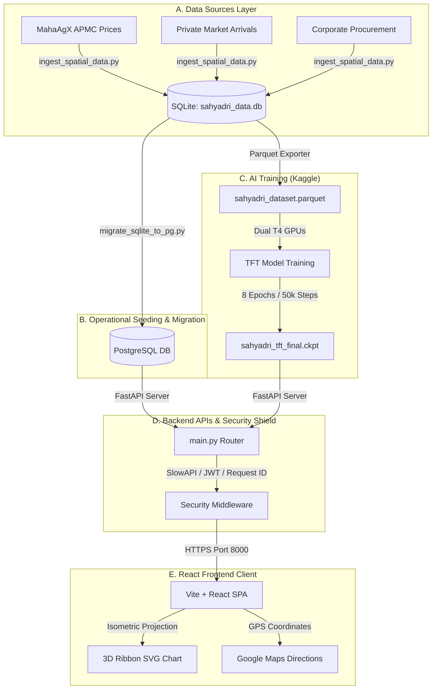

# Project Sahyadri 2.0
### AI-Powered Multi-Horizon Price Forecasting & Spatial Arbitrage Recommendation System

Presented by: Project Sahyadri Team
Maharashtra, India

---

# Slide 1: Introduction & Simple Analogy
## What is Project Sahyadri 2.0?

* **👶 The Analogy:**
  > Imagine you are a farmer with a truck full of freshly harvested Soyabeans. You want to make the most money, but you don't know if you should sell today at the local market, or wait a few weeks and drive to a bigger market in the next town.
  > 
  > Sahyadri 2.0 is a smart digital advisor that tells you exactly **when**, **where**, and **how** to sell to make the most profit.

* **⚙️ The Tech:** An integrated decision engine combining deep learning forecasts, spatial mapping, and a voice chatbot.

---

# Slide 2: The Problem Statement
## Post-Harvest Decision Challenges for Farmers

* **Information Asymmetry:** Farmers rely on fragmented info for prices (APMCs), weather (IMD), storage (MSWC), and bank credit.
* **Distress Selling:** Farmers often liquidate crops immediately at low spot prices because they need cash to pay off crop loans or buy inputs.
* **Financial Impact:** Sub-optimal selling decisions lead to losses of **₹500 to ₹1,500 per quintal**.

---

# Slide 3: Project Goals
## What We Achieve

1. **Data Fusion:** Consolidation of spot prices, warehouse capacities, logistics mileage, bank loans, and weather data.
2. **AI Price Forecasting:** Google's TFT Deep Learning model generates price boundaries (minimum, modal, maximum).
3. **Logistics & Storage Optimizer:** Math engine calculates transport costs and warehouse financing to recommend strategies.
4. **Conversational Interface:** Voice-enabled chatbot communicating in English, Marathi, and Hindi.

---

# Slide 4: Data Ingestion & Storage
## Ingesting 3.1M+ Rows of Agricultural Data

* **👶 The Analogy:** Fusing ingredients in a shopping cart before baking a cake.
* **ES Retrieval:** Queries raw JSON documents from the **MahaAgriExchange (MahaAgX)** portal.
* **Core Datasets:**
  1. *Daily APMC Market Prices* (MahaAgX ID: `09739e2a...`)
  2. *Private Market Prices* (MahaAgX ID: `474b0c02...`)
  3. *Agro-Industrial Direct Transactions* (MahaAgX ID: `7676296a...`)
* **Parquet Exporter:** Compresses JSON lines into `sahyadri_dataset.parquet` for high-speed ML training.

---

# Slide 5: Data Preprocessing & Sequence Prep
## Preparing Temporal Data for Deep Learning

* **Data Cleansing:** Discards corrupted entries where `price <= 100` INR/qtl.
* **Weekly Resampling:** Rounds transactions to Sunday weekly bounds:
  $$\text{week\_date} = \text{date} + ((6 - \text{weekday}) \bmod 7)\text{ days}$$
* **Continuous Indexing:** Computes continuous timeline index `time_idx` (elapsed weeks) and filters out sequences shorter than 15 weeks.
* **Gap Filling:** Performs forward-fill (`ffill`) on prices and zero-fill (`0.0`) on trade volume.

---

# Slide 6: Deep Learning Model Training (TFT)
## Multi-Horizon Price Forecasting

* **👶 The Analogy:** A smart weather robot that remembers past seasons and predicts next week's weather.
* **Framework:** PyTorch Forecasting built on top of PyTorch Lightning.
* **Training Platform:** Kaggle Notebook using dual **Nvidia Tesla T4 GPUs**.
* **Model Configs:** Lookback (12 weeks) and forecast horizon (4 weeks). 8 training epochs and 50,112 steps.
* **Quantile Loss (`[0.1, 0.5, 0.9]`):** Outputs worst-case (10th percentile), modal (50th percentile), and best-case (90th percentile) price limits.

---

# Slide 7: Spatial Database Seeding
## Integrating Registries with Soils GeoJSON

* **DB Registries:** Seeding MSWC Warehouses (200), DCCB Banks (7,608), and KVK stations (101).
* **Soil Testing Labs:** Ingested **873 verified Maharashtra soil labs** from the new `MahaAGX_SoilLabs.geojson` dataset.
* **Coordinate Swap:** Translates coordinate arrays `[lng, lat]` (GeoJSON standard) to map arrays `[lat, lng]`.
* **Geo-Estimation Engine:** Matches address text against `location_coords.json` to resolve coordinates.
* **DCCB Bank Interest Rates:** Derived deterministically (7.0% - 7.9%) using MD5 hashes of bank and branch names.

---

# Slide 8: Database Migration (SQLite to PostgreSQL)
## High-Performance psycopg2 Bulk Streamer

* **👶 The Analogy:** Moving water using a giant pipe rather than carrying it cup-by-cup.
* **Bulk Streaming:** Streams SQLite rows to PostgreSQL (port 5432) in chunks of **25,000 rows** (`CHUNK_SIZE`) using `psycopg2.extras.execute_values()`.
* **Migration Speed:** Exceeds **10,000+ rows per second** (migrates 3.1M+ rows in under 5 minutes).
* **Database Indices:** Builds `idx_transactions_comm_dist`, `idx_transactions_source_market`, and `idx_transactions_date`.
* **Table Sync:** Truncates and migrates warehouses, DCCB bank branches, soil labs, and KVK stations.

---

# Slide 9: Backend Server & Security Shield
## FastAPI ASGI Server & HTTP Middlewares

* **Server:** FastAPI served by Uvicorn. Enables HTTPS via `sahyadri.crt/key`.
* **Rate Limiting:** SlowAPI caps requests per client IP (Redis storage cache, memory fallback).
* **Security Middleware:**
  * Injects unique UUID string tracker (`X-Request-ID` header).
  * Computes process duration (`X-Process-Time` header).
  * Masking: Sets header to `Server: Sahyadri Secure Shield` to hide backend details and masks unhandled exceptions in production.

---

# Slide 10: React Frontend Dashboard
## 3D Isometric SVG Ribbon Charts & Geolocation

* **Vite + React SPA:** Styled with Vanilla CSS.
* **Z-Index Fix:** Modifies stacking triggers to prevent select boxes from clipping behind cards.
* **3D Isometric Ribbon Price Chart:**
  * Trigonometric projection formulas:
    $$px = 75 + x \cos(12^\circ) + z \cos(-22^\circ), \quad py = 155 - y + x \sin(12^\circ) + z \sin(-22^\circ)$$
  * Painter's Algorithm: Renders ribbons from back-to-front (Rank 2 first, Rank 0 last) to prevent overlap.
  * Cubic Bezier Curves: Uses SVG `C` commands to smooth curves.
* **GPS Mode Geolocation:** Requests coordinates to calculate exact transport routes.

---

# Slide 11: The API Connection Layer
## 8 Core Endpoints Connecting Client & Server

* **Diagnostics:** `GET /api/health` - Checks DB pool, Redis, and TFT model loading status.
* **Dropdown Helpers:** `GET /api/suggest` - Localizes crop/district filters on the fly.
* **Forecasting:** `GET /api/forecast` - Fetches price predictions for charting.
* **Spatial Matching:** `GET /api/spatial` - Pulls warehouses, banks, soil labs, and KVKs.
* **Arbitrage Solver:** `GET /api/recommend` - Calculates vehicle logs, loans, and net return.
* **Secured Chat:** `POST /api/chat` - Dialog with chatbot Mitra (JWT protected).
* **Disease Diagnosis:** `POST /api/upload-image` - Diagnoses crop leaves (Gemini Vision).
* **Speech Audio:** `GET /api/tts` - Audio feedback stream (Google TTS MP3).

---

# Slide 12: Unified System Architecture Diagram

