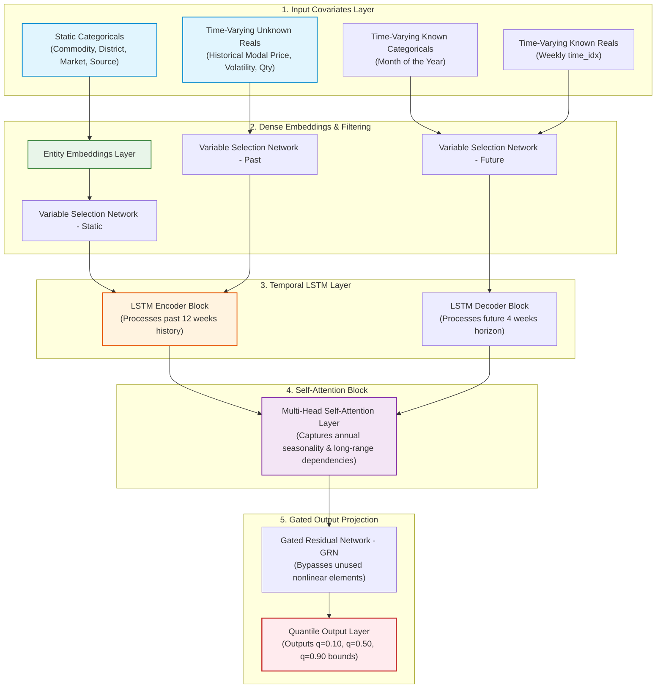

# Temporal Fusion Transformer (TFT) Deep Learning Model Specifications

This document provides an in-depth technical breakdown of the **Temporal Fusion Transformer (TFT)** price forecasting model deployed in Project Sahyadri 2.0. Trained on over **31 Lakh (3.1 million) rows** of historical transaction logs, this state-of-the-art model generates probabilistic price bounds (Quantiles) for multiple agricultural commodities across regulated mandis (APMCs), private markets, and corporate direct procurement channels in Maharashtra.

---

## 1. End-to-End System Architecture

The following diagram illustrates how raw transaction sequences pass through embeddings, temporal recurrent layers, self-attention blocks, and gated units to compute future price predictions:



---

## 2. Temporal Window Mechanics (Encoder vs. Decoder)

In the frontend, when a user queries a 30-day forecast, the system fetches the last 12 weeks of historical records to run inference. The model utilizes a strict sequence window configuration:

```
  Historical Lookback (Encoder Length)            Forecast Window (Decoder Length)
  ◄──────────── 12 Weeks (84 Days) ────────────► ◄────── 4 Weeks (28-30 Days) ──────►
  [============================================] [==================================]
   Past Price, Quantity, & Volatility Sequence    Day 7       Day 14       Day 30
                                                 (Week 1)    (Week 2)     (Week 4)
```

### A. Lookback History (Encoder)
* **Maximum Sequence Length (`max_encoder_length`):** **12 Weeks (84 Days)**. The model looks back at 12 historical weekly steps of transaction data.
* **Minimum Required History (`min_encoder_length`):** **6 Weeks (42 Days)**. If a mandi node does not have at least 6 weeks of valid records on or before the query date, the system identifies the sequence as too short for TFT and redirects it to the **Heuristic Fallback Engine** to ensure stability.

### B. Look-Ahead Forecast (Decoder)
* **Prediction Horizon (`max_prediction_length`):** **4 Weeks (28 to 30 Days)**. The decoder takes the 12-week context and predicts prices for Week 1 (Day 7), Week 2 (Day 14), and Week 4 (Day 30).

---

## 3. Data Cleaning & Feature Engineering

The raw JSON files fetched from the MahaAgX Elasticsearch clusters were compiled and engineered in [`sahyadri_colab_training.py`](file:///c:/Users/Shashank/OneDrive/Desktop/data_sets_fetched/market_and_transaction_data/sahyadri_colab_training.py) to enable robust model training.

### A. Data Preprocessing & Cleaning
1. **Datetime Standardization**: Parsed raw dates into uniform datetime objects.
2. **Outlier Filtering**: Excluded corrupt records where `modal_price` was less than or equal to ₹100/quintal (filtering out noise, bulk organic waste, or data entry glitches).
3. **Daily to Weekly Resampling**: To process the massive 3.1 million records without memory exhaustion, transactions are rounded to their nearest Sunday and collapsed into weekly blocks:
   * `modal_price` $\rightarrow$ Weekly Mean.
   * `min_price` $\rightarrow$ Weekly Minimum.
   * `max_price` $\rightarrow$ Weekly Maximum.
   * `quantity` $\rightarrow$ Weekly Sum.
4. **Gap Filling & Sequence Continuity**:
   * Gaps are filled by **forward-filling (`ffill`) prices** (assuming last known price if no trades occurred).
   * Missing volumes are set to **`0.0`** (since no actual trade took place).
5. **Length Filtering**: Dropped time-series sequences containing fewer than **15 consecutive weeks** of total history.

### B. Feature Covariate Categories
TFT separates input parameters into four logical categories to establish causal relationships:

| Feature Category | Variables | Role in Model |
| :--- | :--- | :--- |
| **Static Categoricals** | `commodity`, `district`, `market_name`, `source_type` | Encoded via dense embeddings. Shared attributes allow the model to generalize patterns across similar regions or commodities. |
| **Time-Varying Known Categoricals** | `month` (1-12) | Captures cyclic crop seasonality (e.g., harvest arrivals in specific months driving prices down). |
| **Time-Varying Known Reals** | `time_idx` (cumulative elapsed weeks) | Align time-series timelines chronologically. |
| **Time-Varying Unknown Reals** | `modal_price`, `quantity`, `volatility_4w` | Target variable and historical indicators. Volatility is a rolling 4-week standard deviation representing market stability. |

---

## 4. Training Specifications

Model training was conducted using the following hyperparameters in Kaggle with PyTorch Forecasting:

* **Accelerator**: Dual Nvidia Tesla T4 GPUs (GPU T4 x 2)
* **Optimization**: **Ranger Optimizer** (initial learning rate of `0.03`).
* **Regularization**: Dropout of `0.15` and Gradient Norm Clipping of `0.1` to prevent exploding gradients.
* **Batch Size**: `256`
* **Early Stopping**: Validation loss (`val_loss`) monitored with a patience of `5 epochs` and a minimum delta of `1e-4`. 
* **Epochs Reached**: Trained for **8 full epochs** (checkpoint saved at `epoch=7-step=50112.ckpt` after 50,112 optimizer steps) before early stopping terminated training due to validation loss stabilization.

---

## 5. Loss Function: Quantile Loss

Instead of predicting a single deterministic number (which fails to account for market uncertainties), the TFT model uses **Quantile Loss**:

$$\text{QuantileLoss}(y, \hat{y}) = \max\left(q \cdot (y - \hat{y}), (q - 1) \cdot (y - \hat{y})\right)$$

Predictions are output at three critical quantiles $[q=0.10, q=0.50, q=0.90]$:
1. **10th Percentile ($q=0.10$):** Inverted as the **Minimum Price Boundary** (worst-case scenario).
2. **50th Percentile ($q=0.50$):** Inverted as the **Modal Price** (most expected market rate).
3. **90th Percentile ($q=0.90$):** Inverted as the **Maximum Price Boundary** (best-case scenario).

---

## 6. Real-Time Production Inference Flow

When a user requests a price forecast on the frontend, the FastAPI backend's [`forecast_agent.py`](file:///c:/Users/Shashank/OneDrive/Desktop/data_sets_fetched/market_and_transaction_data/backend/app/agents/forecast_agent.py) executes the following sequence:

1. **Database Query**: Fetches the transaction history for the queried commodity and district up to the selected base date.
2. **Data Checking**:
   * If there are **fewer than 5 daily records** in total, it immediately forwards to the **Heuristic Fallback Engine**.
3. **Aggregation & Normalization**:
   * Aggregates the daily data to Sunday weekly steps.
   * Forward-fills price gaps and zero-fills quantities.
   * Computes the 4-week rolling volatility indicator (`volatility_4w`).
4. **Sequence Evaluation**:
   * If the sequence has **fewer than 6 weeks** of historical steps, it triggers the **Heuristic Fallback Engine**.
5. **TFT Model Execution**:
   * Appends 4 empty future weeks (setting future volumes to `0` and month to target calendar months).
   * Formats the variables into a PyTorch `TimeSeriesDataSet`.
   * Feeds the tensor into the lazy-loaded `sahyadri_tft_final.ckpt` model weights.
   * Extracts predictions for Week 1 (Day 7), Week 2 (Day 14), and Week 4 (Day 30) across the three quantiles.
6. **Heuristic Fallback Engine**:
   * If TFT is bypassed, the backend computes a **linear trend slope** on the historical prices and applies a **commodity-specific seasonality coefficient** based on peak harvest months (e.g., Onion harvest in March-April and October-November decreases prices by 7%; off-harvest months increase prices by 10%).
7. **Response Formatting**: Returns the modal forecasts and quantile intervals to the React frontend to display on the 3D price charts.
