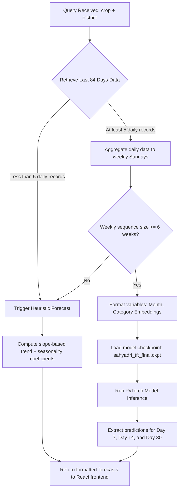

# Temporal Fusion Transformer (TFT) Model Training & Window Specifications

This document outlines the detailed training window parameters, lookback/look-forward configurations, hyperparameters, and production inference mechanics of the **Temporal Fusion Transformer (TFT)** model in Project Sahyadri 2.0.

---

## 1. Sequence Window Architecture (How Days are Looked At)

The forecasting model aggregates transaction records weekly (ending on Sundays) to ensure continuous steps. Predictions are based on the historical sequence length (Encoder) to project future prices (Decoder).

```
 ◄─────────────────────────── 12 Weeks (84 Days) ───────────────────────────► ◄── 4 Weeks (30 Days) ──►
 [==========================================================================] [========================]
  Historical Price & Volume Sequences (Encoder Length)                        Forecast Window (Decoder)
                                                                             
                                                                              Day 0: Spot Price
                                                                              Day 7: Week 1 Projection
                                                                              Day 14: Week 2 Projection
                                                                              Day 30: Week 4 Projection
```

### A. Lookback History (Encoder)
* **Maximum Lookback Window (`max_encoder_length`):** **12 Weeks (84 Days)** of historical daily transactions grouped into weekly blocks.
* **Minimum Required History (`min_encoder_length`):** **6 Weeks (42 Days)**. If a mandi node does not have at least 6 weeks of valid transactional data on or before the base date, the backend isolates the node and triggers the **Heuristic Fallback** forecasting logic to prevent model failure.

### B. Look-Ahead Target (Decoder)
* **Maximum Forecast Horizon (`max_prediction_length`):** **4 Weeks (28 to 30 Days)**. The model takes the 12-week context and predicts prices for the next 4 sequential weeks.

---

## 2. Key Hyperparameters & Training Specifications

The model was trained on dual Nvidia Tesla T4 GPUs in a Kaggle environment using the following parameters defined in [`sahyadri_colab_training.py`](file:///c:/Users/Shashank/OneDrive/Desktop/data_sets_fetched/market_and_transaction_data/sahyadri_colab_training.py):

| Hyperparameter | Value | Description |
| :--- | :--- | :--- |
| **`max_encoder_length`** | `12` | Historical lookback size in weeks (~84 days) |
| **`max_prediction_length`** | `4` | Prediction horizon size in weeks (~30 days) |
| **`batch_size`** | `256` | Batch size per training step |
| **`learning_rate`** | `0.03` | Initial learning rate using the Ranger optimizer |
| **`dropout`** | `0.15` | Regularization dropout rate to prevent overfitting |
| **`gradient_clip_val`** | `0.1` | Gradient norm clipping to prevent explosion |
| **`loss`** | `QuantileLoss` | Generates probabilistic bounds at $[q=0.1, q=0.5, q=0.9]$ |

---

## 3. Quantile Probabilistic Projections

Rather than predicting a single "exact" price, the TFT model outputs three quantiles to represent market bounds:
1. **10th Percentile ($q=0.10$):** Inverted as the **Minimum Price Boundary** (representing worst-case price scenarios).
2. **50th Percentile ($q=0.50$):** Inverted as the **Modal Price** (the most statistically likely price).
3. **90th Percentile ($q=0.90$):** Inverted as the **Maximum Price Boundary** (representing best-case seller price).

---

## 4. Production Inference Engine Flow

When a user opens the Market Dashboard or Chatbot and queries a crop forecast, the backend executes the following logic in [`forecast_agent.py`](file:///c:/Users/Shashank/OneDrive/Desktop/data_sets_fetched/market_and_transaction_data/backend/app/agents/forecast_agent.py):


