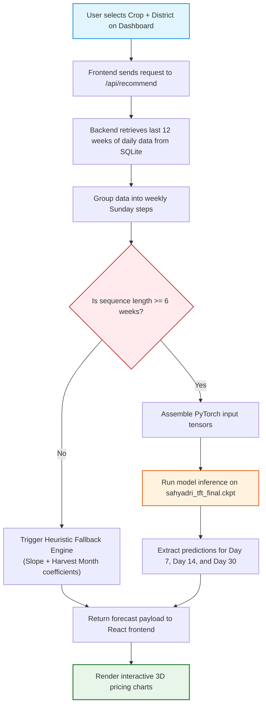

# Simplified Guide: Temporal Fusion Transformer (TFT) Price Forecasting

This document provides a simple, high-level overview of the datasets, the Temporal Fusion Transformer (TFT) forecasting model, and the step-by-step logic that executes when a user selects a district and crop on the dashboard.

---

## 1. What Dataset is Used?

The model was trained on **over 31 Lakh (3.1 million) rows** of historical transaction logs in Maharashtra from 2013/2015 to 2026. This data is merged and compressed into a single high-performance file, [`sahyadri_dataset.parquet`](file:///c:/Users/Shashank/OneDrive/Desktop/data_sets_fetched/market_and_transaction_data/sahyadri_dataset.parquet), combining three primary channels:

1. **APMC Mandis**: Government-regulated daily wholesale market transactions.
2. **Private Markets**: Transaction records from private trading hubs.
3. **Agro-Industrial Buyers**: Direct purchase contracts between farmers and corporate buyers.

---

## 2. What is the TFT Model?

* **Description**: The **Temporal Fusion Transformer (TFT)** is a state-of-the-art deep learning model designed by Google specifically for time-series forecasting.
* **Why it was chosen**: Standard forecasting models only look at past prices. TFT is highly advanced because it processes **static factors** (like the crop type, district name, and mandi source) and **seasonal factors** (like the calendar month, which naturally flags crop harvest cycles) alongside historical rates and volumes.
* **The Outputs**: Instead of predicting a single guess, TFT outputs three distinct pricing bounds representing market volatility:
  * **Minimum Price** (10th percentile / worst-case scenario)
  * **Modal Price** (50th percentile / most likely rate)
  * **Maximum Price** (90th percentile / best-case scenario)

---

## 3. How Predictions Work (User-Selection Logic)

When a farmer interacts with the dashboard dropdowns and selects a **Commodity** (e.g., *Onion*) and a **District** (e.g., *Pune*), the system executes the following steps:

### Step 1: Frontend Request
The web browser makes a secure API call to the FastAPI backend: 
`POST /api/recommend` or `POST /api/chat` passing the selected crop, district, and coordinates.

### Step 2: Retrieve Recent History
The backend queries the SQLite database (`sahyadri_data.db`) to retrieve the daily transaction history for that specific crop and district for the **last 12 weeks (84 days)**.

### Step 3: Weekly Resampling & Aggregation
Because daily transactions can be volatile or have gaps, the backend aligns the records:
* Daily prices are averaged into weekly Sunday steps.
* Traded volumes (quantities) are summed weekly.
* If a week had no trades, the price is **forward-filled** from the prior week, and the quantity is set to **`0.0`**.

### Step 4: Sequence Length Check & Fallback
* **If the history is shorter than 6 weeks**: The sequence is too brief for the TFT model. The system automatically switches to the **Heuristic Fallback Engine** (which fits a linear slope on historical prices and applies harvest seasonality multipliers) to guarantee the user gets a forecast.
* **If the history has at least 6 weeks of data**: The backend compiles the data, calculates the rolling 4-week volatility index, and formats the inputs into PyTorch tensors.

### Step 5: TFT Inference Execution
The backend feeds the input tensors into the pre-trained weights file (`sahyadri_tft_final.ckpt`) running on the CPU.

### Step 6: Frontend Render
The model generates price and range projections for **Week 1 (Day 7), Week 2 (Day 14), and Week 4 (Day 30)**. These values are returned to the React frontend, which immediately renders the interactive 3D pricing charts.

---

## 4. Flowchart of the Prediction Lifecycle

