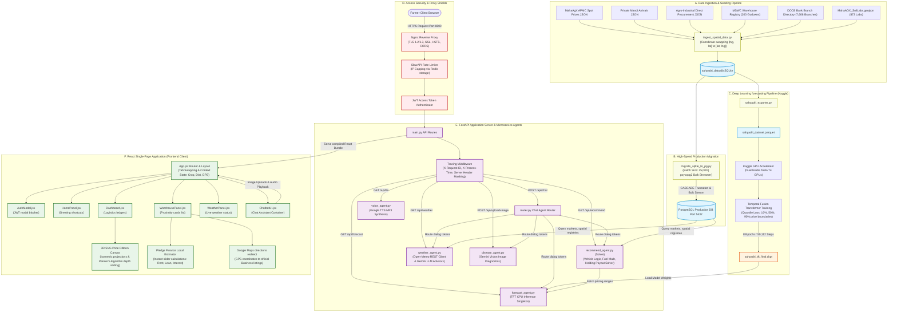

```mermaid
graph TD
    %% Styling Classes
    classDef datastore fill:#e1f5fe,stroke:#0288d1,stroke-width:2px;
    classDef model fill:#fff3e0,stroke:#e65100,stroke-width:2px;
    classDef security fill:#ffebee,stroke:#c62828,stroke-width:2px;
    classDef controller fill:#f3e5f5,stroke:#7b1fa2,stroke-width:2px;
    classDef ui fill:#e8f5e9,stroke:#2e7d32,stroke-width:2px;
    classDef script fill:#f9fbe7,stroke:#afb42b,stroke-width:2px;

    %% A. DATA SOURCES & SEEDING LAYER
    subgraph Layer_A ["A. Data Ingestion & Seeding Pipeline"]
        S1["MahaAgX APMC Spot Prices JSON"]
        S2["Private Mandi Arrivals JSON"]
        S3["Agro-Industrial Direct Procurement JSON"]
        S4["MSWC Warehouse Registry (200 Godowns)"]
        S5["DCCB Bank Branch Directory (7,608 Branches)"]
        S6["MahaAGX_SoilLabs.geojson (873 Labs)"]
        
        SeedScript["ingest_spatial_data.py<br/>(Coordinate swapping [lng, lat] to [lat, lng])"]
        SQLite[(sahyadri_data.db SQLite)]
        
        S1 --> SeedScript
        S2 --> SeedScript
        S3 --> SeedScript
        S4 --> SeedScript
        S5 --> SeedScript
        S6 --> SeedScript
        SeedScript --> SQLite
    end
    class SQLite datastore;
    class SeedScript script;

    %% B. DATABASE MIGRATION ENGINE
    subgraph Layer_B ["B. High-Speed Production Migration"]
        MigrateScript["migrate_sqlite_to_pg.py<br/>(Batch Size: 25,000 | psycopg2 Bulk Streamer)"]
        Postgres[(PostgreSQL Production DB Port 5432)]
        
        SQLite --> MigrateScript
        MigrateScript -->|CASCADE Truncation & Bulk Stream| Postgres
    end
    class Postgres datastore;
    class MigrateScript script;

    %% C. DEEP LEARNING MODEL TRAINING (KAGGLER ENVIRONMENT)
    subgraph Layer_C ["C. Deep Learning forecasting Pipeline (Kaggle)"]
        ParquetExporter["sahyadri_exporter.py"]
        ParquetFile["sahyadri_dataset.parquet"]
        Kaggle["Kaggle GPU Accelerator<br/>(Dual Nvidia Tesla T4 GPUs)"]
        TFTModel["Temporal Fusion Transformer Training<br/>(Quantile Loss: 10%, 50%, 90% price boundaries)"]
        TFTCKPT["sahyadri_tft_final.ckpt"]
        
        SQLite --> ParquetExporter
        ParquetExporter --> ParquetFile
        ParquetFile --> Kaggle
        Kaggle --> TFTModel
        TFTModel -->|8 Epochs / 50,112 Steps| TFTCKPT
    end
    class ParquetFile datastore;
    class TFTCKPT model;
    class ParquetExporter script;

    %% D. PRODUCTION SECURITY SHIELDS
    subgraph Layer_D ["D. Access Security & Proxy Shields"]
        Nginx["Nginx Reverse Proxy<br/>(TLS 1.2/1.3, SSL, HSTS, CORS)"]
        SlowAPI["SlowAPI Rate Limiter<br/>(IP Capping via Redis storage)"]
        JWT["JWT Access Token Authenticator"]
        
        Client([Farmer Client Browser]) -->|HTTPS Request Port 8000| Nginx
        Nginx --> SlowAPI
        SlowAPI --> JWT
    end
    class Nginx,SlowAPI,JWT security;

    %% E. FASTAPI BACKEND APPLICATION SERVER & MICROSERVICES
    subgraph Layer_E ["E. FastAPI Application Server & Microservice Agents"]
        MainApp["main.py API Routes"]
        Middleware["Tracing Middleware<br/>(X-Request-ID, X-Process-Time, Server Header Masking)"]
        Router["router.py Chat Agent Router"]
        
        TFT_Inference["forecast_agent.py<br/>(TFT CPU Inference Singleton)"]
        RecAgent["recommend_agent.py (Solver)<br/>(Vehicle Logic, Fuel Math, Holding Payout Solver)"]
        WeatherAgent["weather_agent.py<br/>(Open-Meteo REST Client & Gemini LLM Advisors)"]
        DiseaseAgent["disease_agent.py<br/>(Gemini Vision Image Diagnostics)"]
        VoiceAgent["voice_agent.py<br/>(Google TTS MP3 Synthesis)"]
        
        JWT --> MainApp
        MainApp --> Middleware
        
        Middleware -->|GET /api/recommend| RecAgent
        Middleware -->|GET /api/forecast| TFT_Inference
        Middleware -->|GET /api/weather| WeatherAgent
        Middleware -->|POST /api/chat| Router
        Middleware -->|POST /api/upload-image| DiseaseAgent
        Middleware -->|GET /api/tts| VoiceAgent
        
        Router -->|Route dialog tokens| WeatherAgent
        Router -->|Route dialog tokens| DiseaseAgent
        Router -->|Route dialog tokens| TFT_Inference
        Router -->|Route dialog tokens| RecAgent
        
        TFTCKPT -->|Load Model Weights| TFT_Inference
        
        Postgres -->|Query markets, spatial registries| RecAgent
        Postgres -->|Query markets, spatial registries| WeatherAgent
        
        RecAgent -->|Fetch pricing ranges| TFT_Inference
    end
    class MainApp,Middleware,Router,TFT_Inference,RecAgent,WeatherAgent,DiseaseAgent,VoiceAgent controller;

    %% F. REACT SINGLE-PAGE APPLICATION (SPA CLIENT)
    subgraph Layer_F ["F. React Single-Page Application (Frontend Client)"]
        AppJS["App.jsx Router & Layout<br/>(Tab Swapping & Context State: Crop, Dist, GPS)"]
        AuthModal["AuthModal.jsx<br/>(JWT modal blocker)"]
        
        HomePanel["HomePanel.jsx<br/>(Greeting shortcuts)"]
        Dashboard["Dashboard.jsx<br/>(Logistics ledgers)"]
        WarehousePanel["WarehousePanel.jsx<br/>(Proximity cards list)"]
        WeatherPanel["WeatherPanel.jsx<br/>(Live weather status)"]
        ChatbotUI["ChatbotUI.jsx<br/>(Chat Assistant Container)"]
        
        RibbonChart["3D SVG Price Ribbon Canvas<br/>(Isometric projections & Painter's Algorithm depth sorting)"]
        PledgeCalc["Pledge Finance Local Estimator<br/>(Instant slider calculations: Rent, Loan, Interest)"]
        GMaps["Google Maps directions redirect<br/>(GPS coordinates to official Business listings)"]
        
        MainApp -->|Serve compiled React Bundle| AppJS
        AppJS --> AuthModal
        AppJS --> HomePanel
        AppJS --> Dashboard
        AppJS --> WarehousePanel
        AppJS --> WeatherPanel
        AppJS --> ChatbotUI
        
        Dashboard --> RibbonChart
        WarehousePanel --> PledgeCalc
        WarehousePanel --> GMaps
        ChatbotUI -->|Image Uploads & Audio Playback| AppJS
    end
    class AppJS,AuthModal,HomePanel,Dashboard,WarehousePanel,WeatherPanel,ChatbotUI,RibbonChart,PledgeCalc,GMaps ui;
```
