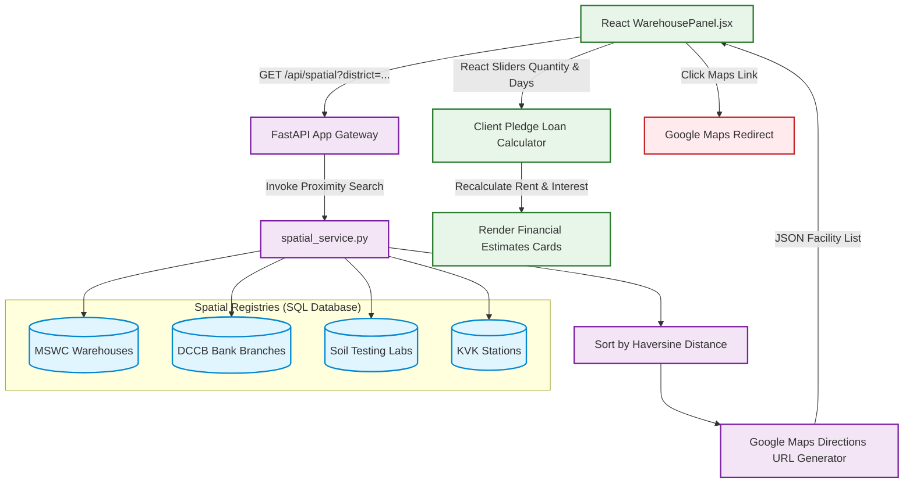

# Detailed Architectural Report: Warehouse Mapping & Pledge Financing Architecture

This document details the logic, purpose, spatial database design, and credit calculation engines behind the **Warehouse & Pledge Financing System** in Project Sahyadri 2.0.

---

## 1. The Core Logic & Business Problem
During seasonal harvest peaks, crop supply saturates local markets, causing prices to crash temporarily. Farmers who have bills to pay cannot afford to wait for prices to recover. This leads to **distress selling**.

### Why this System exists:
The Warehouse Mapping & Pledge Financing system provides a clear financial alternative:
1. **Pledge Storage:** Allows the farmer to store their crop in a state-run **MSWC (Maharashtra State Warehousing Corporation)** godown.
2. **Liquidity Generation (Warehouse Receipt Loan):** The farmer takes the warehouse receipt to a local cooperative bank (**DCCB - District Central Co-operative Bank**). The bank issues an immediate short-term loan (pledge finance) using the stored crop as collateral (typically 75% of spot value).
3. **Debt Repayment & Hold Strategy:** The farmer uses the loan to settle immediate bills. When market prices recover weeks later, they sell the crop, repay the bank loan (with accrued interest), pay the warehouse storage rent, and keep the surplus profit.

---

## 2. Technical Achievement (How We Achieved It)

```
 [ GeoJSON Data Ingestion ] ──────► [ SQLite/PostgreSQL Tables ]
                                            │
                                            ▼ (Haversine Sorted Query)
 [ Client Input Sliders ] ────────► [ Proximity Distance Calculations ]
                                            │
                                            ▼
                                 [ Pledge Finance Math Engine ]
                                 (Loan, Interest & Rent Outputs)
                                            │
                                            ▼
                                 [ Google Maps API Redirect ]
```

### A. Seeding Spatial Registries
The system relies on geographic registries seeded into the SQL databases from spatial data files:
1. **MSWC Warehouses Table:** 200 state warehouses containing storage capacity, location coordinates, and dynamic rent rates.
2. **DCCB Branches Table:** 7,608 rural bank branch listings.
3. **Soil Testing Labs Table:** Seeded from the new `MahaAGX_SoilLabs.geojson` dataset, expanding verified listings from 399 to **873 verified Maharashtra soil labs**.
4. **KVK Stations Table:** 101 agronomic extension centers.

### B. Geodesic Proximity Math (Haversine Formula)
To locate the closest assets relative to the farmer (GPS fields or district center coordinates), the backend implements the **Haversine formula** in [spatial_service.py](file:///c:/Users/Shashank/OneDrive/Desktop/data_sets_fetched/market_and_transaction_data/backend/app/utils/spatial_service.py):

$$d = 2 R \arcsin\left(\sqrt{\sin^2\left(\frac{\Delta \text{lat}}{2}\right) + \cos(\text{lat}_1)\cos(\text{lat}_2)\sin^2\left(\frac{\Delta \text{lon}}{2}\right)}\right)$$

Where:
* $R$ is the Earth's radius ($6,371.0 \text{ km}$).
* $lat_1, lon_1$ are user coordinates.
* $lat_2, lon_2$ are warehouse/bank coordinates.

* **Proximity Sorting:** The query pulls matching facilities, calculates geodesic distance, sorts them, and returns the top listings.
* **Statewide Cross-District Fallback:** If a queried district does not contain a specific facility (e.g., no KVK station in a new district), the backend runs a statewide fallback search, calculating distances across all statewide locations to return the top 5 closest facilities.

### C. Pledge Financing Math Engine
Once the nearest warehouse and bank branch are resolved, the backend extracts the following:
* **Rent Rate ($R_{rent}$):** Extracted from the MSWC warehouse record (falls back to crop defaults, e.g. ₹12/qtl/month for Soybean).
* **Interest Rate ($I_{rate}$):** Pulled from the nearest DCCB bank branch (derived deterministically between 7.0% - 7.9% p.a. based on bank name MD5 hash to reflect local rates).
* **Loan-To-Value (LTV):** Extracted from crop specifications (e.g. 75% for Soybean, 80% for Wheat).

The frontend recalculator updates these values instantly via interactive sliders:
* **Warehouse Receipt Loan Amount:**
  $$\text{Loan Principal} = \text{Spot Price} \times Q \times LTV$$
* **Storage Rent cost for $D$ days:**
  $$\text{Accumulated Rent} = Q \times R_{rent} \times \left( \frac{D}{30} \right)$$
* **Accrued Bank Interest for $D$ days:**
  $$\text{Interest Expense} = \text{Loan Principal} \times I_{rate} \times \left( \frac{D}{365} \right)$$

---

## 3. Warehouse System Architecture (Data & Calculation Flow)



---

## 4. Google Maps Direction Routing Integration
The system constructs directions URLs linking the farmer's origin to target facilities:
$$\text{https://www.google.com/maps/dir/?api=1\&origin=}\{\text{Origin}\}\text{\&destination=}\{\text{Destination}\}$$

* **Origin Formulation:**
  * **GPS Enabled:** Passes raw decimal coordinates (`origin=lat,lng`).
  * **Fallback:** Passes URL-encoded district name string (`origin=District+Name,+Maharashtra,+India`).
* **Destination Query Optimization:** Instead of passing coordinates, it encodes the business string:
  * e.g., `destination=MSWC+Warehouse+Udgir,+Latur,+Maharashtra,+India`
  * **Why:** This forces Google Maps to search for the official business registry. It guarantees the user gets active contact details, hours, and is routed to the **actual main vehicle gate** rather than a coordinate points fence line.
