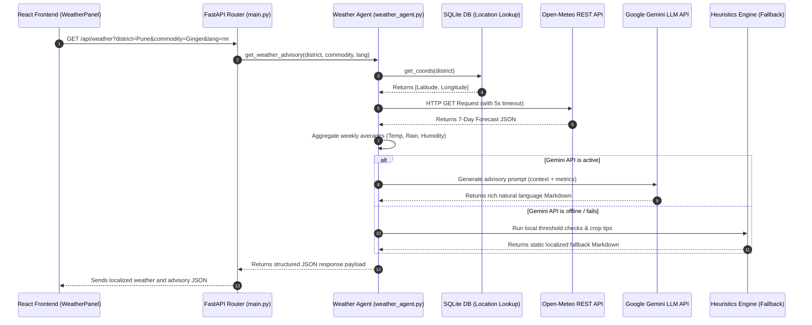

# Weather Forecasting & Crop Advisory Architecture

This document describes the execution flow, metrics calculation, and fallback architecture of the **Weather Forecasting & Crop Advisory System** in Project Sahyadri 2.0.

---

## 1. Technical Architecture & Sequence Flow

Below is the sequence diagram illustrating how requests flow from the React frontend, through the FastAPI backend and database coordinate resolution, to the meteorological endpoints and advisory compilers.



---

## 2. API Endpoint & Core Calling Logic

### Endpoint
* **Path:** `/api/weather`
* **File:** [`main.py`](file:///c:/Users/Shashank/OneDrive/Desktop/data_sets_fetched/market_and_transaction_data/backend/app/main.py#L354)
* **Rate Limit:** 30 requests/minute via `SlowAPI`.

### External Request details
* **Meteorological Source:** Open-Meteo (Free, Keyless REST API).
* **Endpoint URL:**
  `https://api.open-meteo.com/v1/forecast?latitude={lat}&longitude={lon}&daily=temperature_2m_max,temperature_2m_min,rain_sum,relative_humidity_2m_max&timezone=auto`
* **Source Code Implementation:** [`fetch_weather_data` in weather_agent.py](file:///c:/Users/Shashank/OneDrive/Desktop/data_sets_fetched/market_and_transaction_data/backend/app/agents/weather_agent.py#L19-L30) (uses Python's `urllib.request` with a 5-second connection timeout).

---

## 3. Calculations & Aggregations

Once the 7-day Daily forecast array is fetched, the backend calculates the following aggregate fields:

| Metric | Calculation Method | Purpose |
| :--- | :--- | :--- |
| **Average Max Temperature** | $\frac{1}{7} \sum_{i=1}^{7} \text{DailyMaxTemp}_i$ | Analyzes heat stress suitability for crops |
| **Total Rainfall Sum** | $\sum_{i=1}^{7} \text{DailyRainSum}_i$ | Dictates irrigation schedules and drainage warnings |
| **Average Max Humidity** | $\frac{1}{7} \sum_{i=1}^{7} \text{DailyMaxHumidity}_i$ | Detects microclimates high-risk for blights/fungi |

---

## 4. Double-Layered Resiliency Logic (Isolating the LLM Dependency)

To guarantee that the farm advisory is robust even when external LLM endpoints are down or timed out, the system isolates the advisory compiler into two layers:

```
                  ┌───────────────────────────────┐
                  │   Is Gemini API Configured?   │
                  └───────────────┬───────────────┘
                                  │
                 ┌────────────────┴────────────────┐
                 │                                 │
                YES                                NO
                 │                                 │
                 ▼                                 ▼
    ┌─────────────────────────┐       ┌─────────────────────────┐
    │  Query Gemini LLM with  │       │  Trigger Local Rules    │
    │  structured Prompt context│      │  (Heuristics Engine)    │
    └─────────────────────────┘       └─────────────────────────┘
```

### Layer 1: Online Mode (Google Gemini LLM)
If Gemini is active, a detailed agricultural context is constructed containing:
* District metadata & coordinates.
* Commodity context (e.g., Ginger, Soybean, Cotton, Onion).
* Language constraints (`mr` for Marathi, `hi` for Hindi, `en` for English).
* Aggregated weekly forecast parameters.

The LLM is prompted to output a professional, encouraging advisory in the localized tongue.

### Layer 2: Offline Mode (Local Heuristics Fallback)
If Gemini times out or is inactive, the program calls [`generate_offline_advisory`](file:///c:/Users/Shashank/OneDrive/Desktop/data_sets_fetched/market_and_transaction_data/backend/app/agents/weather_agent.py#L32-L131):
* **Temperature Threshold:** If average max temp $> 35^\circ\text{C}$, append a heat stress warning recommending morning/evening irrigation.
* **Rainfall Threshold:** If total rainfall $> 30\text{mm}$, append warnings for heavy rain (water drainage, postponement of chemical sprays).
* **Relative Humidity Threshold:** If average max humidity $> 80\%$, append alerts for fungal blights and pest outbreaks.
* **Crop Heuristics:** Injects hardcoded guidelines matching the active crop:
  * *Onion:* Purple blotch fungicide warning, drainage advice.
  * *Soybean:* Rust disease avoidance, caterpillar checking.
  * *Cotton:* Pink bollworm trapping, field water evacuation.
