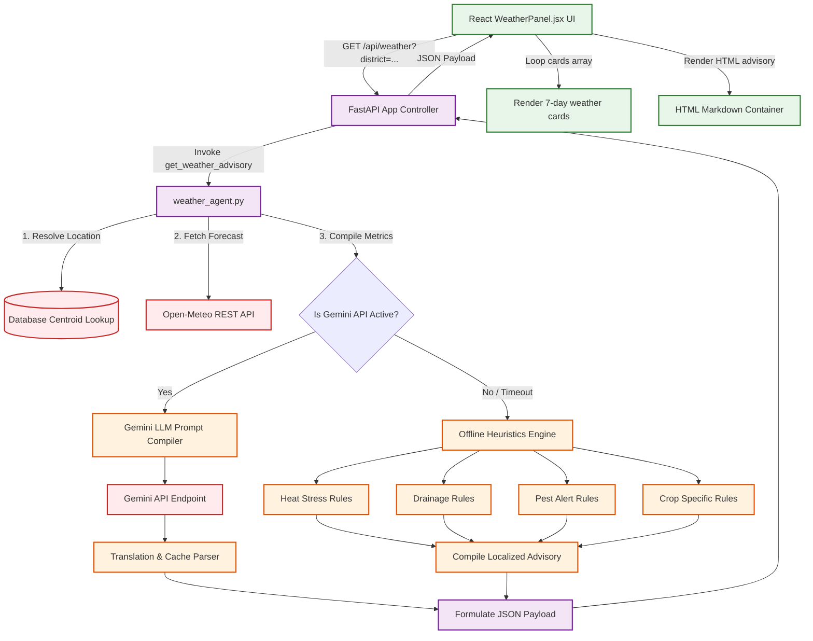

# Detailed Architectural Report: Weather Forecasting & Crop Advisory System

This document details the logic, purpose, external meteorological integrations, AI prompt engineering structures, and offline fallback mechanics of the **Weather Forecasting & Crop Advisory Agent** in Project Sahyadri 2.0.

---

## 1. The Core Logic & Business Problem
Meteorological conditions dictate the success of agricultural operations. Farmers require highly practical weather forecasts to coordinate critical tasks:
* **Sowing Decisions:** Soil moisture must be adequate; planting too early in dry soil or too late in heavy rain kills seeds.
* **Chemical Applications:** Fungicides, pesticides, and fertilizers are expensive. If applied right before rain, they wash away, causing economic loss and chemical runoff.
* **Harvest Protection:** Rains during harvest spoil ripe crops, leading to rot and fungal contamination (e.g., purple blotch in Onion, rust in Soybean).

### Why this System exists:
The Weather & Crop Advisory system translates complex meteorological data into **actionable agricultural advisories**:
1. **Real-time Live Forecasts:** Collects current local weather variables directly.
2. **Crop Contextualization:** Combines weather projections with crop growth stages.
3. **AI Dialog Generation:** Fuses LLM reasoning to draft localized, practical step-by-step guidance.
4. **Resiliency Guardrails:** Operates offline heuristic engines to ensure farmers get guides even during cloud or network outages.

---

## 2. Technical Achievement (How We Achieved It)

```
   [ Get District Centroid Coords ]
                  │
                  ▼
   [ Open-Meteo REST API Fetch ]
                  │
                  ▼ (Parse 7-Day JSON Variables)
   [ Aggregate Weather Statistics ]
                  │
        Is Gemini LLM Active?
        ├──► Yes: [ Inject Prompt Templates ] ──► [ Generate Gemini Advisory ]
        └──► No:  [ Run Offline Heuristics ] ──► [ Apply Code-Level Rules ]
                  │
                  ▼ (Translate Output Markdown)
   [ React UI Rendering (WeatherPanel.jsx) ]
```

### A. Real-Time Meteorological Retrieval
When the `/api/weather` endpoint is invoked, the backend uses Python's standard `urllib.request` library to hit the Open-Meteo forecast API:
```
https://api.open-meteo.com/v1/forecast?latitude={lat}&longitude={lon}&daily=temperature_2m_max,temperature_2m_min,rain_sum,relative_humidity_2m_max&timezone=auto
```
* **Why Open-Meteo?** It is a fast, free, developer-friendly forecasting source that requires no API keys, eliminating key rotation or authentication locks.
* **Variables Parsed:** Maximum/minimum temperatures, daily rainfall accumulations (in mm), and relative humidity peaks (%).

### B. Double-Layered Advisory Generator
The core AI reasoning occurs in [weather_agent.py](file:///c:/Users/Shashank/OneDrive/Desktop/data_sets_fetched/market_and_transaction_data/backend/app/agents/weather_agent.py):

#### Layer 1: Google Gemini LLM Generation (Online Mode)
If the Google Gemini API key is configured, the system retrieves a Gemini model instance. It builds a structured markdown prompt containing:
1. **Geographic location & crop name** (e.g., "Soybean crop in Latur District").
2. **Calculated weekly weather summaries:**
   * Average maximum temperature.
   * Total accumulated rain sum.
   * Average maximum humidity.
3. **A structured 7-day daily forecast list.**
4. **Strict agricultural guidelines:** Focus on temperature impact, drainage advice, and pest risks.
5. **Formatting requirements:** Output in the target language (Marathi, Hindi, English) with clear markdown layout and encouraging emojis.

#### Layer 2: Offline Heuristics Rules Engine (Fallback Mode)
If Gemini is offline, the system evaluates code-level parameters to compile a fallback guide:
* **Heat Stress:**
  $$\text{IF Average Max Temp} > 35^\circ\text{C} \implies \text{Append temperature advisory.}$$
* **Rain Alert:**
  $$\text{IF Accumulated Rain} > 30\text{mm} \implies \text{Append waterlogging drainage warning.}$$
* **Pest & Disease Alert:**
  $$\text{IF Average Max Humidity} > 80\% \implies \text{Append fungal blight alert.}$$
* **Crop Specific Heuristics:** Appends tailored crop tips (e.g. spray schedule for Onion, pink bollworm trapping rules for Cotton, rust alerts for Soybean).

---

## 3. Weather Agent System Architecture

Below is the clean system layout showing weather data retrieval, advisory routing, and rendering paths:



---

## 4. Localization and Display Rendering
1. **Dynamic Localization:** Standard translations for display titles are resolved client-side. The advisory text is localized dynamically by Gemini or selected from pre-translated offline heuristic blocks in Devanagari script (Marathi/Hindi).
2. **HTML Safe String Replacement:** The advisory Markdown returned by the server is parsed inside React into safe HTML structures:
   ```javascript
   // Replaces markdown formatting with semantic HTML elements
   const formattedHtml = weather.advisory
     .replace(/\n/g, '<br />')
     .replace(/\*\*(.*?)\*\*/g, '<strong>$1</strong>')
     .replace(/### (.*?)(<br \/>)/g, '<h4 class="font-bold text-base text-green-400 mt-3 mb-1.5">$1</h4>')
     .replace(/• (.*?)(<br \/>)/g, '<div class="flex items-start gap-2 py-0.5"><span class="text-green-500">•</span><span>$1</span></div>');
   ```
3. **Dynamic Icons Selection:** The dashboard selects lucide-react icons client-side depending on daily metrics:
   * $Rain > 5.0\text{mm} \implies \text{CloudRain}$
   * $MaxTemp > 35^\circ\text{C} \implies \text{Sun (with slow rotate animation)}$
   * $Rain > 0.5\text{mm} \implies \text{CloudSun}$
   * $Dry \implies \text{Cloud}$
